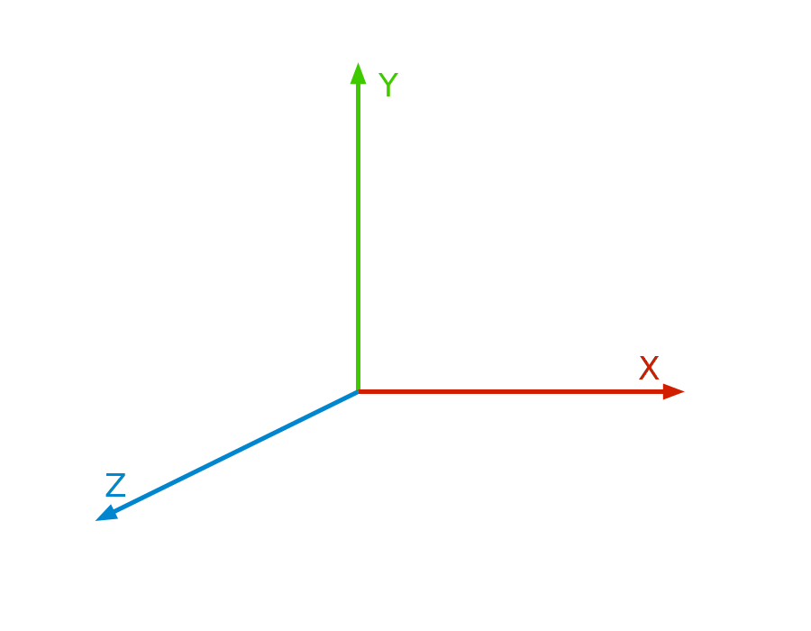
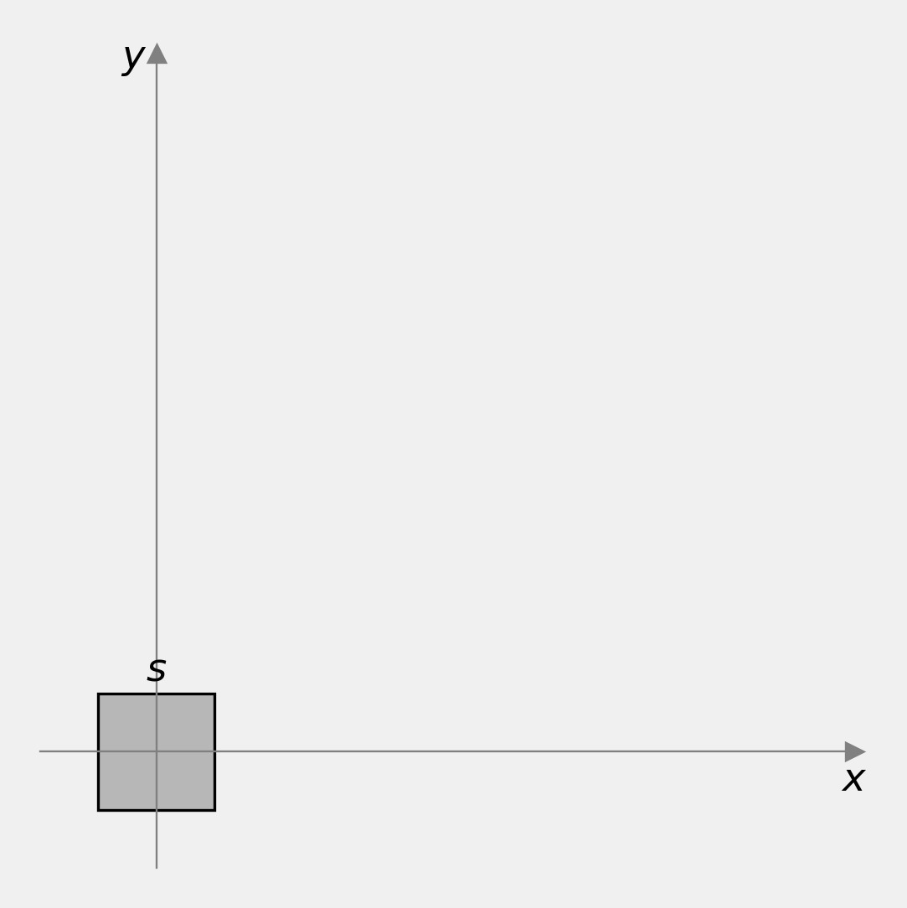
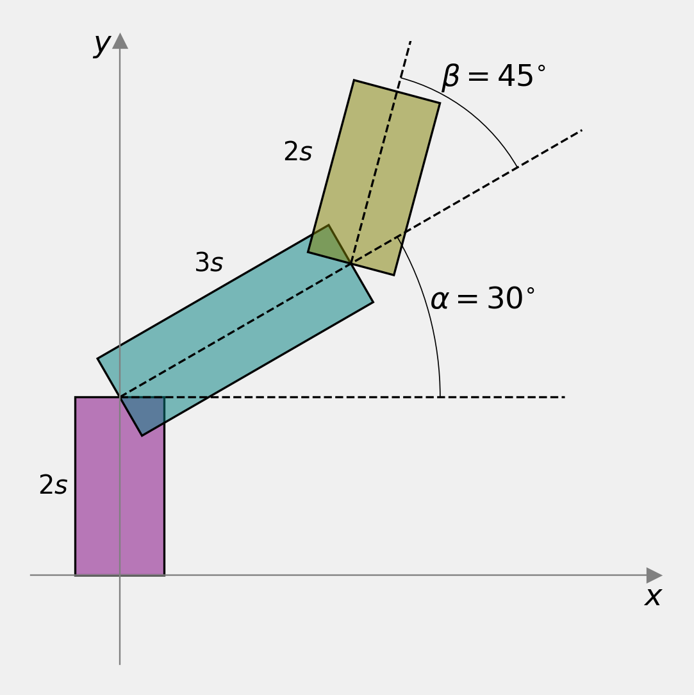
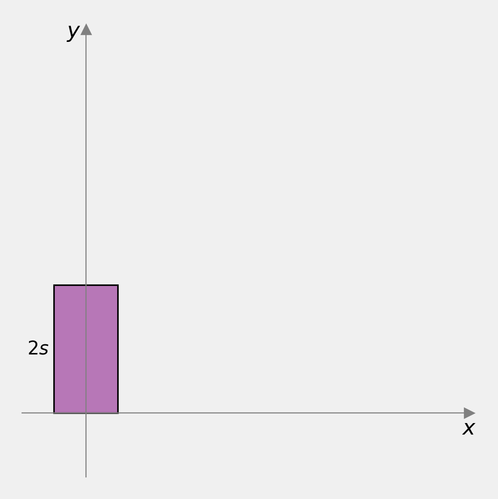
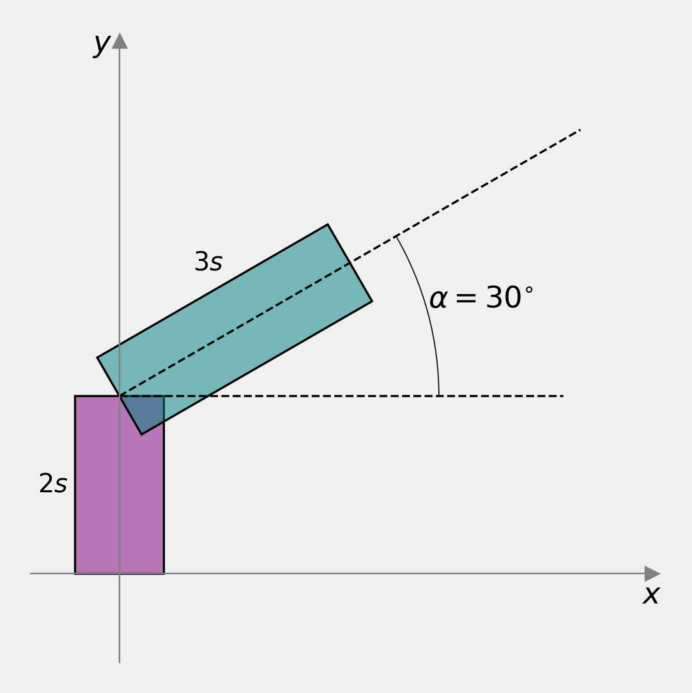

# Content

- World Coordinate System
- Combined Transformations
- Articulated Structures

# Combining 2D Transformations

**Order** matters!

## Recap {data-auto-animate="true"}

So far we have looked at individual 2D transformations applied to the vertices of a 2D polygon.

::: notes
Even though a polygon - or indeed a model - may have many vertices, we apply the same operation to each vertex.
:::

## Recap {data-auto-animate="true"}

Having put in place a uniform method, applicable to **all** transformations, we can now look at _combining_ transformations.

::: notes
What is this uniform method called?
:::

## Recap {data-auto-animate="true"}

We will show now that the _order_ of the applied transformations is absolutely **crucial** to obtain the desired results!

## World Coordinate System {data-auto-animate="true"}

Where in the world do we start?

## World Coordinate System {data-auto-animate="true"}

Most graphics systems adopt a World Coordinate System (WCS),
with a camera in a particular position and orientation.

## World Coordinate System {data-auto-animate="true"}

For example in _OpenGL_, the camera is at the origin of the WCS pointing in the negative z-direction with its "up" vector pointing in the y-direction.

::: notes
Different frameworks adopt different conventions. It is common to see z-up and y-up.
3D packages?
Note - these are just labels for consistent reference - we could easily convert to other conventions.
:::

## World Coordinate System {data-auto-animate="true"}

So far we have been working with 2D transformations.

Given the description of the OpenGL coordinate system, what has been the significance of the z-axis?

::: incremental

- Answer: It is the _axis_ of **rotation**.

:::

::: notes
wherever some vertex is in our scene, when we rotate with R, we rotate about the z-axis.
:::

## World Coordinate System {data-auto-animate="true"}

::: columns

::: column

The WCS is represented by a _right-handed_ coordinate system, with the z-axis popping out of the screen.

- For 2D, we draw in the x-y plane, and **rotate** about the z-axis.

:::

::: column

:::

:::

# Combined Transformations

**Order** matters...

::: notes
This is the big takeaway from this lecture.
:::

## Recap: Matrix Multiplication

Matrix multiplication **is** _associative_:

$$ABC=A(BC)=(AB)C$$

Matrix multiplication is **not** _commutative_:

$$AB \neq BA$$

::: notes
Of course, we need the shape to be appropriate for multiplication.
Emphasis - this is really important to understand - and remember.
:::

# Combined Transformations

Start with two common concatenated transformations:

1. _Rotate_ the model, then _translate_ it.
2. _Translate_ the model, then _rotate_ it.

::: notes
As well as the rules of multiplication, we need to remember that the order of the transformations is important.
REMEMBER: Rotation is about the z-axis!!
:::

# Combined Transformations

Start with two common concatenated transformations:

1. $$
   \begin{bmatrix} x' \\ y' \\ 1 \end{bmatrix} =
   \begin{bmatrix} 1  & ~0& ~t_x \\ 0  & ~1& ~t_y \\ 0  & ~0& ~1 \end{bmatrix}
   \begin{bmatrix}
    \cos \alpha&        -\sin \alpha& ~0 \\
    \sin \alpha&~       ~\cos \alpha& ~0 \\
            0&                   0& ~1
    \end{bmatrix}
   \begin{bmatrix} x \\ y \\ 1 \end{bmatrix}
   $$

2. $$
   \begin{bmatrix} x' \\ y' \\ 1 \end{bmatrix} =
   \begin{bmatrix}
    \cos \alpha&        -\sin \alpha& ~0 \\
    \sin \alpha&~       ~\cos \alpha& ~0 \\
            0&                   0& ~1
    \end{bmatrix}
   \begin{bmatrix} 1  & ~0& ~t_x \\ 0  & ~1& ~t_y \\ 0  & ~0& ~1 \end{bmatrix}
   \begin{bmatrix} x \\ y \\ 1 \end{bmatrix}
   $$

::: notes
let's look at this more concretely, with two very common transforms.
:::

---

Multiplying out the first example from right to left:

1. $$
    \begin{aligned}
    \begin{bmatrix} x' \\ y' \\ 1 \end{bmatrix} &=
    %
    \begin{bmatrix} 1  & ~0& ~t_x \\ 0  & ~1& ~t_y \\ 0  & ~0& ~1 \end{bmatrix}
    %
    \begin{bmatrix}
    x \cos \alpha - y \sin \alpha \\
    x \sin \alpha + y \cos \alpha \\
    1
    \end{bmatrix} \\[10pt]
    %
    \Rightarrow
    %
    \begin{bmatrix} x' \\ y' \\ 1 \end{bmatrix} &=
    \begin{bmatrix}
    (x \cos \alpha - y \sin \alpha) + t_x \\
    (x \sin \alpha + y \cos \alpha) + t_y \\
    1
    \end{bmatrix}
    \end{aligned}
   $$

::: notes
let's multiply out from right to left.
Here we rotate first, then translate.
:::

---

Multiplying out the second example from right to left:

2. $$
    \begin{aligned}
    \begin{bmatrix} x' \\ y' \\ 1 \end{bmatrix} &=
    %
   \begin{bmatrix}
    \cos \alpha&  -\sin \alpha& ~0 \\
    \sin \alpha&~ ~\cos \alpha& ~0 \\
               0&            0& ~1
    \end{bmatrix}
    %
    \begin{bmatrix} x + t_x \\ y + t_y \\ 1 \end{bmatrix} \\[10pt]
    %
    \Rightarrow
    %
    \begin{bmatrix} x' \\ y' \\ 1 \end{bmatrix} &=
    \begin{bmatrix}
    (x + t_x) \cos \alpha - (y + t_y) \sin \alpha \\
    (x + t_x) \sin \alpha + (y + t_y) \cos \alpha \\
    1
    \end{bmatrix}
    \end{aligned}
   $$

::: notes
now the 2nd equation - translate first then rotate.
:::

## Combined Transformations

::: {style="font-size: 2.5em"}

$$
RTv \neq TRv
$$

:::

The **order** of the transformations is important.

# Articulated Structures

Hierarchical transformations...

::: notes
we will work through a more complex example - involving a hierarchy of objects.
Skeletons - rigs - characters.
:::

---

Make the articulated structure from only the square polygon.

::: columns

::::: column

:::::

::::: column

:::::

:::

::: notes
Note: I have coloured the items just for reference.
:::

## Assumptions

::: incremental

- The objects are in order of their position in the hierarchy,
  i.e. we start with the first object in the hierarchy, then the next and so on.
- The articulations should be operative rather than static,
  i.e for different value angles, the structure will still be connected.
- We only use the metric $s$ in our transformation matrices.
- The solution may not be unique.

:::

::: notes
We must make some assumptions clear first.
:::

## The base {data-auto-animate="true"}

::: columns

::::: column

:::::

::::: column

:::::

:::

::: notes
We might call this the gantry of a crane.
We need to scale in y, and translate in y.
:::

## The base {data-auto-animate="true"}

::: columns

::::: column

:::::

::::: column

Order of transformations:

1. scale in y, $~s_y = 2$
2. translate in y, $~t_y = 1s$

:::::

:::

::: notes
We need to scale in y, and translate in y.
:::

## The base {data-auto-animate="true"}

$$
\begin{bmatrix} x' \\ y' \\ 1 \end{bmatrix}=
\begin{bmatrix}
    1 & 0 & 0 \\
    0 & 1 & 1s \\
    0 & 0 & 1
\end{bmatrix}
\begin{bmatrix}
    1 & 0 & 0 \\
    0 & 2 & 0 \\
    0 & 0 & 1
\end{bmatrix}
\begin{bmatrix} x \\ y \\ 1 \end{bmatrix}
$$

::: notes
The order of the transformations is important.
We apply the rightmost transformation first.
Associative: ABC=A(BC)=(AB)C
:::

## Link 1 {data-auto-animate="true"}

::: columns

::::: column

:::::

::::: column

:::::

:::

::: notes
This is the first link part, that has some rotation.
:::

## Link 1 {data-auto-animate="true"}

::: columns

::::: column

:::::

::::: column

Order of transformations:

1. scale in x, $~s_x = 3$
2. translate in x, $~t_x = 1.5s$
3. rotate, $~\alpha = 30^{\circ}$
4. translate in y, $~t_y = 2$

:::::

:::

::: notes
We have to start being more careful about the order of the transformations.
:::

## Link 1 {data-auto-animate="true"}

::: {style="font-size: 0.85em"}

$$
\begin{bmatrix} x' \\ y' \\ 1 \end{bmatrix}=
\begin{bmatrix}
    1 & 0 & 0 \\
    0 & 1 & 2s \\
    0 & 0 & 1
\end{bmatrix}
\begin{bmatrix}
    \cos \alpha & - \sin \alpha & 0 \\
    \sin \alpha & \cos \alpha & 0 \\
    0 & 0 & 1
\end{bmatrix}
\begin{bmatrix}
    1 & 0 & 1.5s \\
    0 & 1 & 0 \\
    0 & 0 & 1
\end{bmatrix}
\begin{bmatrix}
    3 & 0 & 0 \\
    0 & 1 & 0 \\
    0 & 0 & 1
\end{bmatrix}
\begin{bmatrix} x \\ y \\ 1 \end{bmatrix}
$$

:::

::: notes
Associative: ABC=A(BC)=(AB)C
:::

## Link 2 {data-auto-animate="true"}

::: columns

::::: column

:::::

::::: column

:::::

:::

::: notes
This part has it's parent's rotation, and its own rotation.
:::

## Link 2 {data-auto-animate="true"}

::: columns

::::: column

:::::

::::: column
Order of transformations:

1. scale in x, $~s_x = 2$
2. translate in x, $~t_x = s$
3. rotate, $~\beta = 45^{\circ}$
4. translate in x, $~t_x = 3s$
5. rotate, $~\alpha = 30^{\circ}$
6. translate in y, $~t_y = 2s$

:::::

:::

::: notes
This part has it's parent's rotation, and its own rotation.
We have a lot of motion here.
:::

## Link 2 {data-auto-animate="true"}

$$
\begin{aligned}
\begin{bmatrix} x' \\ y' \\ 1 \end{bmatrix} =~
&\begin{bmatrix}
    1 & 0 & 0 \\
    0 & 1 & 2s \\
    0 & 0 & 1
\end{bmatrix}
\begin{bmatrix}
    \cos \alpha & - \sin \alpha & 0 \\
    \sin \alpha & \cos \alpha & 0 \\
    0 & 0 & 1
\end{bmatrix}
\begin{bmatrix}
    1 & 0 & 3s \\
    0 & 1 & 0 \\
    0 & 0 & 1
\end{bmatrix} \\[10pt]
&\begin{bmatrix}
    \cos \beta & - \sin \beta & 0 \\
    \sin \beta & \cos \beta & 0 \\
    0 & 0 & 1
\end{bmatrix}
\begin{bmatrix}
    1 & 0 & s \\
    0 & 1 & 0 \\
    0 & 0 & 1
\end{bmatrix}
\begin{bmatrix}
    2 & 0 & 0 \\
    0 & 1 & 0 \\
    0 & 0 & 1
\end{bmatrix}
\begin{bmatrix} x \\ y \\ 1 \end{bmatrix}
\end{aligned}
$$

_NB:_ equation runs over two lines.

## Articulated Arm Template {data-auto-animate="true"}

There is a template solution for each of the three parts.

## Articulated Arm Template {data-auto-animate="true"}

Base:

$$
\begin{bmatrix} x' \\ y' \\ 1 \end{bmatrix}=
\begin{bmatrix}
    1 & 0 & 0 \\
    0 & 1 & ? \\
    0 & 0 & 1
\end{bmatrix}
\begin{bmatrix}
    1 & 0 & 0 \\
    0 & ? & 0 \\
    0 & 0 & 1
\end{bmatrix}
\begin{bmatrix} x \\ y \\ 1 \end{bmatrix}
$$

::: notes
The order of the transformations is important.
We apply the rightmost transformation first.
:::

## Articulated Arm Template {data-auto-animate="true"}

Link 1:

::: {style="font-size: 0.85em"}

$$
\begin{bmatrix} x' \\ y' \\ 1 \end{bmatrix}=
\begin{bmatrix}
    1 & 0 & 0 \\
    0 & 1 & ? \\
    0 & 0 & 1
\end{bmatrix}
\begin{bmatrix}
    \cos \alpha & - \sin \alpha & 0 \\
    \sin \alpha & \cos \alpha & 0 \\
    0 & 0 & 1
\end{bmatrix}
\begin{bmatrix}
    1 & 0 & ?\\
    0 & 1 & 0 \\
    0 & 0 & 1
\end{bmatrix}
\begin{bmatrix}
    ? & 0 & 0 \\
    0 & 1 & 0 \\
    0 & 0 & 1
\end{bmatrix}
\begin{bmatrix} x \\ y \\ 1 \end{bmatrix}
$$

:::

$$ \alpha = ?^{\circ} $$

## Articulated Arm Template {data-auto-animate="true"}

Link 2

$$
\begin{aligned}
\begin{bmatrix} x' \\ y' \\ 1 \end{bmatrix} =~
&\begin{bmatrix}
    1 & 0 & 0 \\
    0 & 1 & ? \\
    0 & 0 & 1
\end{bmatrix}
\begin{bmatrix}
    \cos \alpha & - \sin \alpha & 0 \\
    \sin \alpha & \cos \alpha & 0 \\
    0 & 0 & 1
\end{bmatrix}
\begin{bmatrix}
    1 & 0 & ? \\
    0 & 1 & 0 \\
    0 & 0 & 1
\end{bmatrix} \\[10pt]
&\begin{bmatrix}
    \cos \beta & - \sin \beta & 0 \\
    \sin \beta & \cos \beta & 0 \\
    0 & 0 & 1
\end{bmatrix}
\begin{bmatrix}
    1 & 0 & ? \\
    0 & 1 & 0 \\
    0 & 0 & 1
\end{bmatrix}
\begin{bmatrix}
    ? & 0 & 0 \\
    0 & 1 & 0 \\
    0 & 0 & 1
\end{bmatrix}
\begin{bmatrix} x \\ y \\ 1 \end{bmatrix}
\end{aligned}
$$

$$\alpha = ?^{\circ} ~, ~ \beta = ?^{\circ}$$

::: notes
NOTE: the equation is over two lines.
:::

# Summary

- World Coordinate System
- Combined Transformations
- Articulated Structures

Reading:

- Hearn, D. et al. (2004). Computer Graphics with OpenGL.
- Strang, Gilbert, et al. (1993) Introduction to linear algebra.

::: notes
Hopefully we have established very clearly that order matters when applying transformations.
We used that knowledge to work through a fairly complex example.
We showed that this complexity could be reduced with a templated solution.
:::
