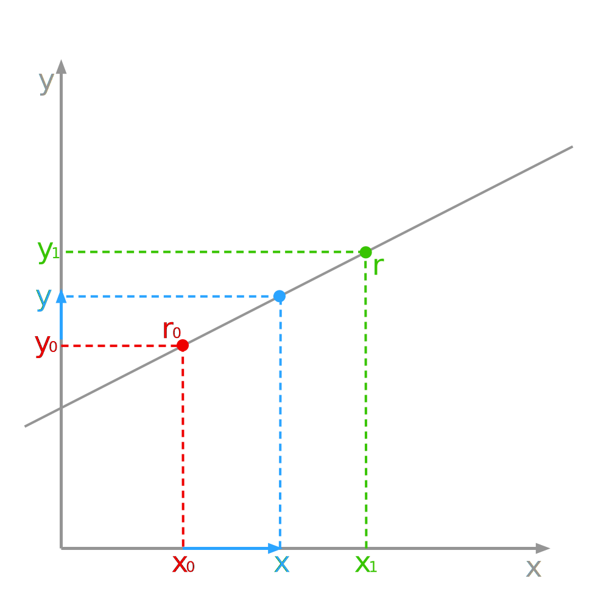

# Contents {data-transition="convex"}

- Theory and Concepts
- Scan Conversion
- Digital Differential Analyser (DDA)

# Lines

A **line** is an _infinitely_ thin, infinitely long collection of points extending in two opposite directions.

::: notes
We know intuitively what a line is, it is actually difficult to give a good mathematical definition.
:::

## Lines

A line **segment** has two _endpoints_ and all the points of the line between them.

::: notes
You can measure the length of a segment, but not of a line.
:::

## Lines

A **ray** is part of a line with one endpoint and extends infinitely in _one_ direction.

::: notes
You cannot measure the length of a ray.
:::

## Representing Lines

We will consider two line representations:

- Parametric, or vector form.
- Cartesian form.

## Parametric Line Equation

A line can be defined as the set of all points in space that satisfy two criteria:

1. Contains a point, which we identify by a position vector $\textbf{r}_0$.
2. The vector between $\textbf{r}_0$ and _any_ position vector $\textbf{r}$ _on_ the line, is **parallel** to a given vector $\textbf{v}$.

## Parametric Line Equation

The vector with initial point $\textbf{r}_0$ and terminal point $\textbf{r}$ is given by:

$$
\textbf{s} = \textbf{r} - \textbf{r}_0
$$

This vector must be parallel to $\textbf{v}$ hence, for some scalar $\lambda$:

$$\textbf{s} = \lambda\textbf{v}$$

## Parametric Line Equation

Any position vector $\textbf{r}$, corresponding to a point $P$ on the line has the form:

$$\textbf{r} = \textbf{r}_0 + \lambda\textbf{v}$$

where $\lambda$ is a scalar called a _parameter_, and this is the **vector** equation.

::: notes
it follows...
The parameter is allowed to be any value, so that any point on the line can be obtained from this equation, which is called the vector equation of the line.
:::

## Parametric Line Equation

::: columns
::::: {.column width=60%}

:::::
::::: {.column style="font-size: 1.8em;"}
$$\textbf{r} = \textbf{r}_0 + \lambda\textbf{v}$$
:::::
:::

::: notes
we don't define a coordinate space here, as r0 is a position vector from any origin.
:::

## Cartesian Line Equation {data-auto-animate="true"}

Algebraically, we can define a line with an **implicit** _linear_ equation:

::: {style="font-size: 1.8em;"}

$$
ax + by + c = 0
$$

:::

::: notes
or algebraic form.
:::

## Cartesian Line Equation {data-auto-animate="true"}

We can derive the implicit form of the line equation from the vector equation.

- Consider coordinates of points on the line as vectors projected to the x-axis and y-axis.
- Apply the vector equation to the x-axis and y-axis projection to obtain the implicit form.

## Cartesian Line Equation {data-auto-animate="true"}

::: columns
::::: {.column width=60%}

:::::
::::: {.column style="font-size: 1.0em;"}

Projecting to the x-axis and y-axis.

$$
\begin{aligned}
\textbf{x} &= \textbf{x}_0 + \lambda(\textbf{x}_1 - \textbf{x}_0) \\
\textbf{y} &= \textbf{y}_0 + \lambda(\textbf{y}_1 - \textbf{y}_0)
\end{aligned}
$$

:::::
:::

::: notes
note that x and y are bold and are vectors, not scalars.
:::

## Cartesian Line Equation {data-auto-animate="true"}

We can remove the scalar $\lambda$ using simultaneous equations:

$$
\begin{aligned}
\textbf{x} &= \textbf{x}_0 + \lambda(\textbf{x}_1 - \textbf{x}_0)
\hspace{20pt} \times (\textbf{y}_1 - \textbf{y}_0) \\
- \textbf{y} &= \textbf{y}_0 + \lambda(\textbf{y}_1 - \textbf{y}_0)
\hspace{20pt} \times (\textbf{x}_1 - \textbf{x}_0)
\end{aligned}
$$

::: notes
we multiply each equation... then subtract...
:::

## Cartesian Line Equation {data-auto-animate="true"}

Giving:

$$
\begin{aligned}
\textbf{x} (\textbf{y}_1 - \textbf{y}_0) - \textbf{y} (\textbf{x}_1 - \textbf{x}_0) &= \textbf{x}_0 (\textbf{y}_1 - \textbf{y}_0) - \textbf{y}_0 (\textbf{x}_1 - \textbf{x}_0) \\
a \textbf{x} + b \textbf{y} &= -c
\end{aligned}
$$

with:

$$
\begin{aligned}
a &= \textbf{y}_1 - \textbf{y}_0 \\
b &= \textbf{x}_0 - \textbf{x}_1 \\
c &= -b\textbf{y}_0 - a\textbf{x}_0
\end{aligned}
$$

::: notes
bold x and y are the vectors projected to the axes...
:::

## Cartesian Line Equation {data-auto-animate="true"}

The vectors $\textbf{x}$ and $\textbf{y}$ can be replaced with scalar values $x$ and $y$, yielding:

$$
ax + by + c = 0 \hspace{20pt} \square
$$

::: notes
Q.E.D. quod erat demonstrandum - what was demonstrated...
:::

## Cartesian Line Equation {data-auto-animate="true"}

The implicit equation has the form:

$$
f(x, y) = C
$$

where $C$ is a constant.

::: notes
so the this is a function of two variables, x, y.
:::

## Cartesian Line Equation {data-auto-animate="true"}

There is also an **explicit** algebraic equation of the form:

$$
y = f(x)
$$

::: notes
so the this is a function of x, x is an independent variable, y is a dependent variable.
:::

## Cartesian Line Equation {data-auto-animate="true"}

From:

$$
\begin{aligned}
ax + by + c =& ~0 \\
\Rightarrow y =&  - \frac{a}{b}x - \frac{c}{b} \\
\Rightarrow y =& mx + d
\end{aligned}
$$

where:

$$
m = - \frac{a}{b}~, ~ d = - \frac{c}{b}
$$

::: notes
note the difference between big C and small c.
:::

## Cartesian Line Equation {data-auto-animate="true"}

Although the explicit equation $y = mx + c$ may be familiar, for computer graphics it is inconvenient, since for vertical lines $m = \infty$.

# Scan Conversion

Lines in mathematics are continuous and have _infinite_ resolution.

A computer screen has finite resolution using discrete picture elements, or **pixels**.

::: notes
we may be rendering to screen, or rendering to an image file.
:::

## Scan Conversion {data-auto-animate="true"}

For rendering, we will discretise the line equation using finite deltas.

$$
y = m x + c \Rightarrow \delta y = \delta m x + c
$$

::: notes
finite differences...
:::

## Scan Conversion {data-auto-animate="true"}

- We always render line **segments**.
- Line segments have a defined start and end point.
- Hence, we can derive the slope and intercept of our line.

$$
\begin{aligned}
m &= \frac{y_{end} - y_0}{x_{end} - x_0} \\
c &= y_0 - m x_0
\end{aligned}
$$

::: notes
you can clearly see here the danger of division by zero.
:::

## Scan Conversion {data-auto-animate="true"}

**NB:** We will ignore the intercept $c$ for the derivations.

- it should be added to the right-hand side of the equation for lines with $c \neq 0$

::: notes
for our algorithms under discussion, we will ignore the intercept $c$ for now.
so, all our discussion will be about lines that pass through the origin.
:::

# Digital Differential Analyser (DDA)

The digital differential analyser (DDA) is a scan-conversion line algorithm based on calculating either $\delta y$ or $\delta x$

::: notes
and as I have said previously we will ignore the intercept $c$ for now.
:::

## Digital Differential Analyser (DDA) {data-auto-animate="true"}

Calculating $\delta x$.
Since the distance between points is measured in pixels;
if we move pixel by pixel along the positive $x$ axis, we have:

$$
\delta x = x_{i+1} - x_i = 1
$$

::: notes
we just step right, one pixel at a time...
:::

## Digital Differential Analyser (DDA) {data-auto-animate="true"}

Calculating $\delta y$.

$$
\begin{aligned}
\delta y &= m \delta x \\
y_{i+1} - y_i &= m (x_{i+1} - x_i)
\end{aligned}
$$

Where $i$ is a grid position of a discreet point on the line, and $i + 1$ is an immediate neighbour on the grid.

::: notes
grid positions are pixels on the screen or image
:::

## Digital Differential Analyser (DDA) {data-auto-animate="true"}

Given $\delta x = x_{i+1} - x_i = 1$:

$$
y_{i+1} = m + y_i
$$

Specifically for:

$$
0 \leq |m| \leq 1
$$

::: notes
be careful here, we have stated x increases by one to the right...
so for lines steeper than m = 1, we will have gaps between pixels.
:::
