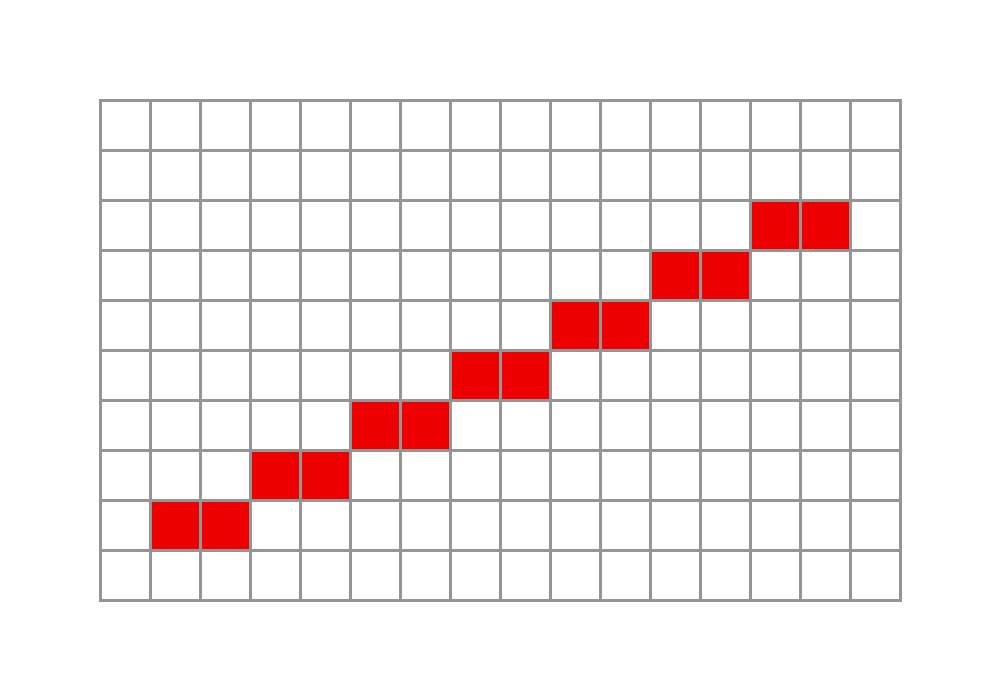

# Contents

- Bresenham's Line Algorithm
- Midpoint Line Algorithm
- Antialiasing

# Bresenham's Line Algorithm {data-auto-animate="true"}

Improving the efficiency of the DDA line drawing algorithm.

::: notes
DDA draws lines on our pixel grid. But, there are lots of floating point conversions.
:::

## Bresenham's Line Algorithm {data-auto-animate="true"}

Let's make clear some assumptions:

- pixel coordinates are integers
- left to right for $x$
- bottom to top for $y$.
- $x_0 < x_1~$ and $~y_0 < y_1$
- the slope of the line is between 0 and 1, i.e. $0 \leq m \leq 1$

::: notes
we already covered the concept of octants...we draw only in the first octant.
and strictly, pixels are on or off...
:::

## Bresenham's Line Algorithm {data-auto-animate="true"}

Following these assumptions, the simplest algorithm is:

```
for x = x0 to x1:
    decide y value
    draw(x, y)
```

What is an _efficient_ way to decide the $y$ value?

::: notes
pseudo code
:::

## Bresenham's Line Algorithm {data-auto-animate="true"}



::: notes
now look at this image... if we are moving left to right, what do we say about how to draw the pixel?
it is only either to the right of the previous pixel, or up and right!
so - we
:::

## Bresenham's Line Algorithm {data-auto-animate="true"}

As we step in the $x$ direction, we observe that $y$ stays the same, or increases by 1.

## Bresenham's Line Algorithm {data-auto-animate="true"}

We can include this observation in our algorithm:

```
x = x0
y = y0
draw(x, y)
while x < x1:
    x = x + 1
    if y should increment:
        y = y + 1
    draw(x, y)
```

::: notes
as we progress with pseudo code...
:::
