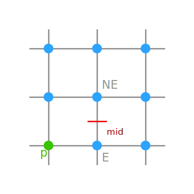
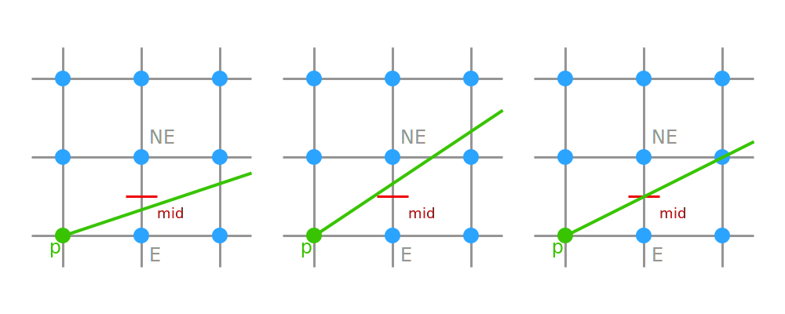
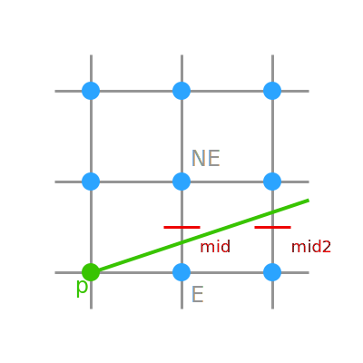
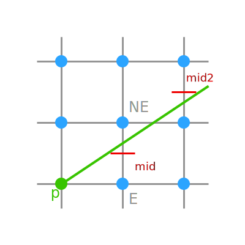

# Contents

- Bresenham's Line Algorithm
- Midpoint Line Algorithm
- Antialiasing

# Bresenham's Line Algorithm {data-auto-animate="true"}

Improving the efficiency of the DDA line drawing algorithm.

- remove floating point operations
- minimise the number of operations

::: notes
DDA draws lines on our pixel grid.
But, there are lots of floating point conversions.
:::

## {data-auto-animate="true"}

Let's make clear some assumptions:

- pixel coordinates are integers
- left to right for $x$
- bottom to top for $y$.
- $x_0 < x_1~$ and $~y_0 < y_1$
- the slope of the line is between 0 and 1, i.e. $0 \leq m \leq 1$

::: notes
we already covered the concept of octants...we draw only in the first octant.
The upper right octant...
and strictly, pixels are on or off...
:::

## {data-auto-animate="true"}

Following these assumptions, the simplest algorithm is:

```{.python}
for x = x0 to x1:
    decide y value
    draw(x, y)
```

What is an _efficient_ way to decide the $y$ value?

::: notes
pseudo code
:::

## {data-auto-animate="true"}


::: notes
now look at this image... if we are moving left to right, what do we say about how to draw the pixel?
it is only either to the right of the previous pixel, or up and right!
so - we
:::

## {data-auto-animate="true"}

As we step in the $x$ direction, we observe that:

- $y$ stays the same
- **or** $y$ increases by 1.

## {data-auto-animate="true"}

We can include this observation in our algorithm:

```{.python}
x = x0
y = y0
draw(x, y)
while x < x1:
    x = x + 1
    if y should increment:
        y = y + 1
    draw(x, y)
```

::: notes
as we progress with pseudo code...
:::

## {data-auto-animate="true"}

Assuming the line is given by $y = mx + c$:

- we are setting ` y = round(mx) + c`
- each unit step of $x$ will increment $y$ by $m$

::: notes
we can ignore c from now on...
:::

## {data-auto-animate="true"}

Let `fraction` be the amount $y$ has increased since the last $y$ increase.

- We want to increment $y$ when `fraction` is $\geq \frac{1}{2}$.

::: notes
now introduce a variable `fraction`...
since the last time y increased...
as the algorithm progresses, when the fraction is over half, we want to move up in y...
:::

## {data-auto-animate="true"}

```{ .python}
x = x0
y = y0
fraction = start_value
fraction_step = (y1 - y0) / (x1 - x0)
draw(x, y)
while x < x1:
    x = x + 1
    fraction = fraction + fraction_step
    if fraction >= 1/2:
        y = y + 1
        fraction = fraction - 1
    draw(x, y)
```

::: notes
Now, we are more or less where we where with DDA.
fraction step is m from the line equation.
we will have fraction +/- 1/2.
We have these floating point numbers we want to get rid of...
:::

## {data-auto-animate="true"}

First we have: $m = \frac{y_1 - y_0}{x_1 - x_0}$

- To remove the fraction, we multiply by $(x_1 - x_0)$.
- To remove the comparison to $1/2$ we multiply by 2.

hence:

$$
\begin{aligned}
fraction\_step &= \frac{y1 - y0}{x1 - x0} \times (x1 - x0) \times 2 \\
        &= 2 (y1 - y0)
\end{aligned}
$$

## {data-auto-animate="true"}

We also want to set a `start_value` for `fraction`:

$$
start\_value = 2(y_1 - y_0) - (x_1 - x_0)
$$

::: notes
skip explanantion...
but it starts with m, offset by 1/2, then we multiply by 2(x1 - x0).
:::

## {data-auto-animate="true"}

```{ .python}
x = x0
y = y0
fraction = 2 * (y1 - y0) - (x1 - x0)
fraction_step = 2 * (y1 - y0)
draw(x, y)
while x < x1:
    x = x + 1
    fraction = fraction + fraction_step
    if fraction >= 0:
        y = y + 1
        fraction = fraction - 2 * (x1 - x0)
    draw(x, y)
```

::: notes
Also, we would prefer to compare to 0, rather than 1.
so our algorithm is...
in real code we would also compute 2DX once...
:::

## Bresenham's Line Algorithm {data-auto-animate="true"}

There are other approaches to deriving the Bresenham Line Algorithm.
The parts are the same, but some details are presented differently.

The course text makes the decision to move up in `y` based on the distance
between the _true_ line and the nearest pixel.

- Hearn & Baker, _Computer Graphics with OpenGL_, 4th Edition, Chapter 5

# Midpoint Line Algorithm {data-auto-animate="true"}

Midpoint is a variation of Bresenham's Line Algorithm.

Same improvement goals:

- remove floating point operations
- minimise the number of operations

::: notes
of course it is functionally identical - it draws lines on our pixel grid.
:::

## Midpoint Line Algorithm {data-auto-animate="true"}

The midpoint algorithm uses 8 compass points to describe the _next_ pixel to draw:

- E, NE, N, NW, W, SW, S, SE

## Midpoint Line Algorithm {data-auto-animate="true"}

We will describe the algorithm just for the _upper right octant_.

- The only possible next directions are E and NE.

## Midpoint Line Algorithm {data-auto-animate="true"}

::: columns
::::: column

:::::
::::: column
For a **previous** pixel `p` in the upper right quadrant, we label the two candidate pixels E and NE.

We will describe criteria based on the midpoint between the two candidates.

:::::
:::

## Midpoint Line Algorithm {data-auto-animate="true"}

The algorithm decides if a **true** line passes either above, below or through the midpoint.

## Midpoint Line Algorithm {data-auto-animate="true"}



::: notes
here we show the previous pixel
the true line in green, in each of 3 possible cases.
The x is the same, but the y is different.
:::

## Midpoint Line Algorithm {data-auto-animate="true"}

`IF the true line is below or on the midpoint: pick the E pixel.`

`ELSE: pick the NE pixel.`

::: notes
almost pseudo code... we will have to reinforce the logic somewhat...
:::

## Midpoint Line Algorithm {data-auto-animate="true"}

We will use the _implicit_ line equation:

$$
ax + by + c = 0
$$

We know that:

$$
a = \Delta y~, b = -\Delta x~ \Rightarrow f(x, y) = x \Delta y - y \Delta x + c = 0
$$

**N.B.** henceforth we will assume $c=0$, and remove from the derivations.

::: notes
we know this from the earlier lecture.
We will not have C involved for brevity
:::

## Decision Variable {data-auto-animate="true"}

**IF** the line goes exactly through the midpoint then we have the decision variable:

$$
\begin{aligned}
D &= f(x_p + 1, y_p + \tfrac{1}{2}) \\
  &= a_{(m)} (x_p + 1) + b_{(m)} (y_p + \tfrac{1}{2}) \\
  &= 0
\end{aligned}
$$

recall, in the upper right octant: $a > 0, ~b < 0$

::: notes
D is a decision variable - when it goes exactly through the midpoint, we pick the E pixel.
because a=y0-y1 and b=x0-x1, from previous lecture.
:::

## Decision Variable {data-auto-animate="true"}

**IF** the line goes _below_ the midpoint:

$$a<a_{(m)} \land b>b_{(m)} \Rightarrow D < 0 \Rightarrow E$$

The actual value of $D(E)$ is:

$$
\begin{aligned}
D(E)    &= f(x_p + 1, y_p) \\
        &= a(x_p + 1) + b y_p \\
        &= a x_p + a + b y_p \\
        &= f(x_p, y_p) + a
\end{aligned}
$$

::: notes
the true a is less than the midpoint a, and the true b is greater than the midpoint b.
we want to take a decision to go East.
here it is just important to do the same consistent thing when we are at the midpoint.
:::

## Decision Variable {data-auto-animate="true"}

**ELSE** the line goes _above_ the midpoint:

$$a>a_{(m)} \land b<b_{(m)} \Rightarrow D > 0 \Rightarrow NE$$

The actual value of $D(NE)$ is:

$$
\begin{aligned}
D(NE)   &= f(x_p + 1, y_p + 1) \\
        &= a(x_p + 1) + b(y_p + 1) \\
        &= a x_p + a + b y_p + b \\
        &= f(x_p, y_p) + a + b
\end{aligned}
$$

::: notes
and, finally, the line goes above - we now pick the NE pixel.
:::

## Decision Variable {data-auto-animate="true"}

To avoid having to recalculate actual decision variable values each
time we move one pixel in x, we can derive a decision variable _increment_ instead.

We do this by looking ahead to the **next** pixel.

## Decision Variable Increment {data-auto-animate="true"}

::: columns
::::: column

:::::
::::: column
If we choose the E pixel then the next midpoint will be at:

$$
\begin{aligned}
D_{mE} &= f(x_p + 2, y_p + \tfrac{1}{2}) \\
  &= a (x_p + 2) + b (y_p + \tfrac{1}{2})
\end{aligned}
$$

Subtracting the original $D$ gives:

$$
\begin{aligned}
\Delta E &= D_{mE} - D \\
    &= a \\
    &= \Delta y
\end{aligned}
$$

:::::
:::

## Decision Variable Increment {data-auto-animate="true"}

::: columns
::::: column

:::::
::::: column
If we choose the NE pixel then the next midpoint will be at:

$$
\begin{aligned}
D_{mNE} &= f(x_p + 2, y_p + \tfrac{3}{2}) \\
  &= a (x_p + 2) + b (y_p + \tfrac{3}{2})
\end{aligned}
$$

Subtracting the original $D$ gives:

$$
\begin{aligned}
\Delta NE &= D_{mNE} - D \\
    &= a+b \\
    &= \Delta y - \Delta x
\end{aligned}
$$

:::::
:::
