# Content

- Polygon Filling
- Scan Line Algorithm
- Boundary Fill Algorithm

::: notes
We can start with what we mean by polygon filling - then we will look at a couple of different approaches to solve the problem.
Scan-line algorithm - works line by line and left to right to fill the polygon.
Boundary fill algorithm - works by growing a seed pixel within the boundary of the polygon.
:::

# Polygon Filling {data-auto-animate="true"}

Identify pixels that belong to the _interior_ of a polygon.
Once identified, we can:

::: incremental

- pass the pixel to the rasteriser
- assign colour to the pixel
- assign a depth value to the pixel
- sample a texture for the pixel

:::

::: notes
once we identify the pixel, we can perform a number of operations, given that knowledge.
:::

## Polygon Filling {data-auto-animate="true"}

::: incremental

- A polygon is a set of vertices that are connected by _edges_.
- We need _efficient_ algorithms to fill polygons.
- We can extend ideas from line drawing to polygon filling.
- Not all polygons are handled equally!

:::

::: notes
Graphics applications often use many, many polygons.
:::

## Convex Polygons {data-auto-animate="true"}

::: columns
::::: column
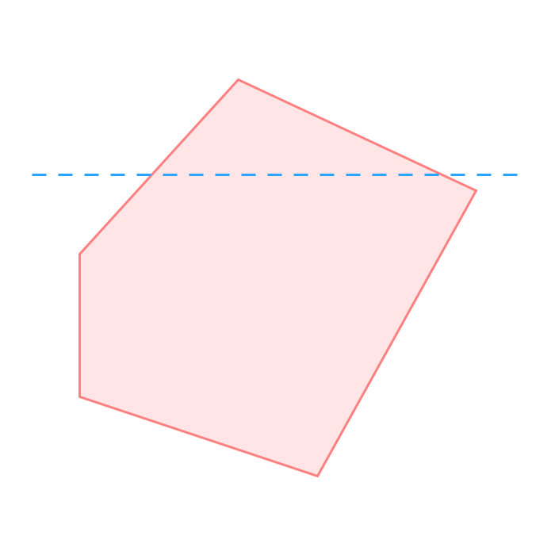
:::::
::::: column

- interior angles $\leq 180^{\circ}$
- scan lines enter the interior once and exit once
- triangles are always convex

:::::
:::

::: notes
I want to be clear here - a scan line is the line we intend to draw
horizontally across the screen.
If we encounter a convex polygon it enters, then exits only once.
Triangles are convex.
One of the reasons many graphics pipelines decompose to tris - they are easier to handle.
:::

## Concave Polygons {data-auto-animate="true"}

::: columns
::::: column
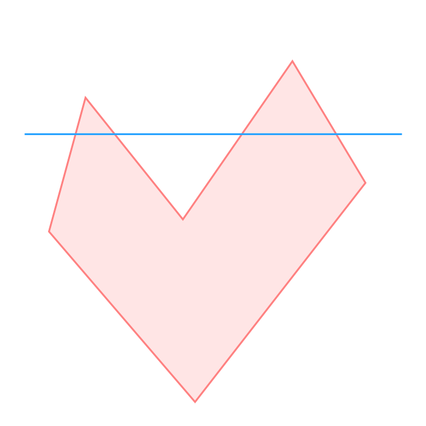
:::::
::::: column

- arbitrarily complex polygons
- scan lines enter and exit many times
- more difficult to fill

:::::
:::

::: notes
can be arbitrarily complex - many vertices and edges - ngons
we need to keep track of when we enter and exit the polygon - somehow...
:::

# Scan-Line Algorithm {data-auto-animate="true"}

The scan-line algorithm must work for **both** convex and concave polygons.

## Scan-Line Algorithm {data-auto-animate="true"}

```
for line in y=0 to y=height:
    counter = 0
    for pixel in x=0 to x=width:
        if edge:
            counter +=1
        if counter is odd:
            draw(line, pixel)
```

::: notes
how about this algorithm? Does this do what we need to do?
Does it work for both convex and concave polygons?
:::

## {data-auto-animate="true"}

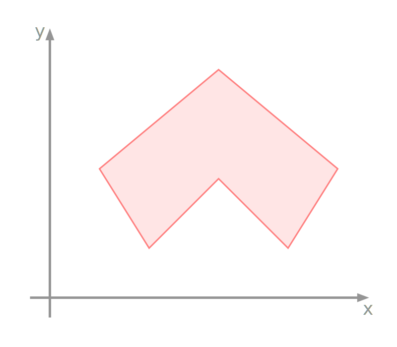{width=75%}

::: notes
here we have a concave polygon, as we pass a scan line up the screen, what happens?
:::

## {data-auto-animate="true"}

{width=75%}

::: notes
It seems our algorithm works fine - as we enter from the left we add one to the counter and draw.
When we leave we increment again and stop drawing, and so on...
:::

## Scan-Line Algorithm {data-auto-animate="true"}

The algorithm seems to work well.

- Have we considered all cases?

::: notes
are there any circumstances we have not considered yet?
:::

## {data-auto-animate="true"}

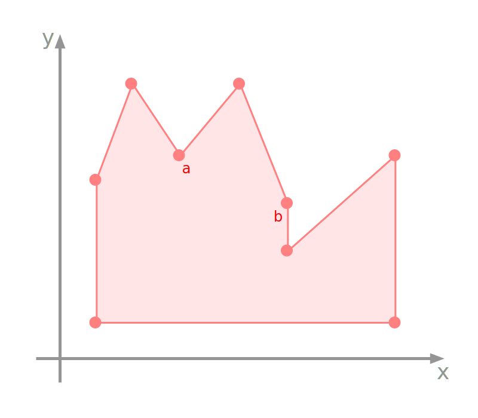{width=75%}

::: notes
here is a more complex polygon - I've labelled some vertices.
what should we do when the scan line passes through a vertex?
:::

## {data-auto-animate="true"}

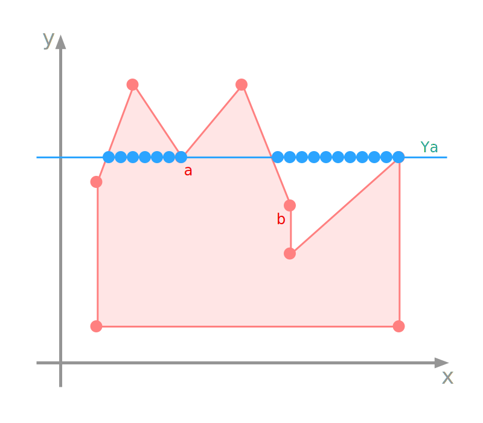{width=75%}

::: notes
what is happening here?
:::

## {data-auto-animate="true"}

::: columns
::::: {.column width=60%}

:::::
::::: {.column width=40%}

- Enter the left edge, increment the counter and draw.
- Pass through vertex $a$, increment the counter and stop drawing.
- Leave the right edge, increment the counter and draw.

:::::
:::

## {data-auto-animate="true"}

::: columns
::::: {.column width=60%}
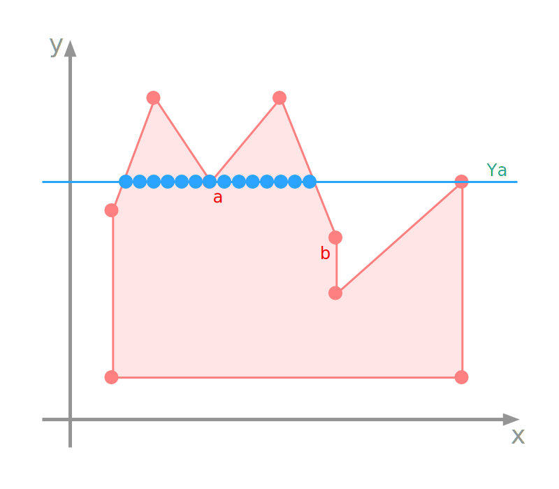
:::::
::::: {.column width=40%}

Solution:

- count the vertex _twice_

:::::
:::

## {data-auto-animate="true"}

::: columns
::::: {.column width=60%}
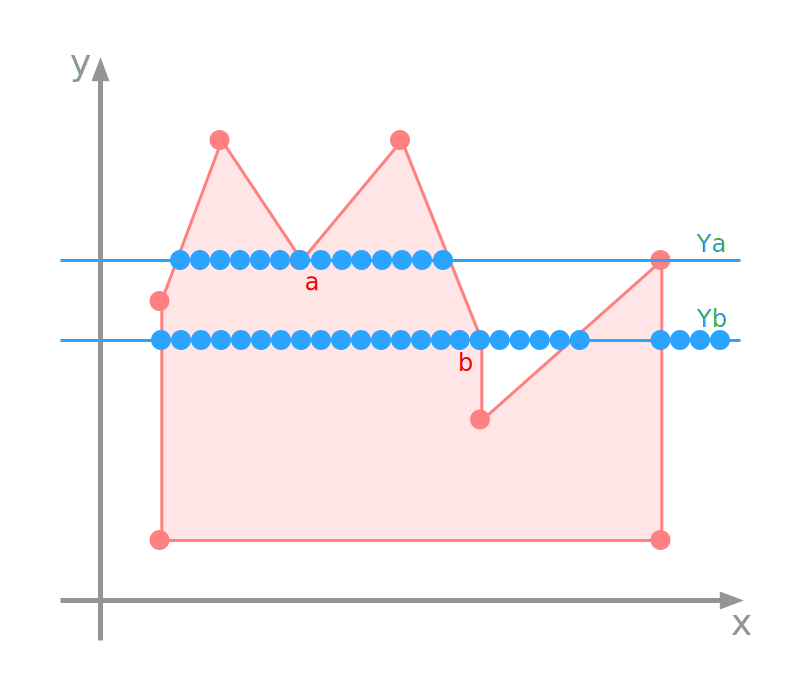
:::::
::::: {.column width=40%}

Problem:

- Counting the vertex twice does not always work!

:::::
:::

::: notes
There is a difference between vertex a and vertex b, however.
:::

## {data-auto-animate="true"}

::: columns
::::: {.column width=60%}

:::::
::::: {.column width=40%}

- consider the _edges_ at each vertex
- edges through vertex $b$ are **monotonic** in $y$

:::::
:::

::: notes
There is a difference between vertex $a$ and $b$ we can take advantage of.
:::

## {data-auto-animate="true"}

::: columns
::::: {.column width=60%}

:::::
::::: {.column width=40%}

If we move around the polygon in a clockwise direction:

- edges that enter and leave vertex **a** go in **opposite** $y$ directions.
- edges that enter and leave vertex **b** go in the **same** $y$ direction.
- edges through vertex **b** are **monotonic** in $y$

:::::
:::

::: notes
Let's put further definition on this...
:::

## {data-auto-animate="true"}

We can _split_ the vertex for _monotonic_ edges:

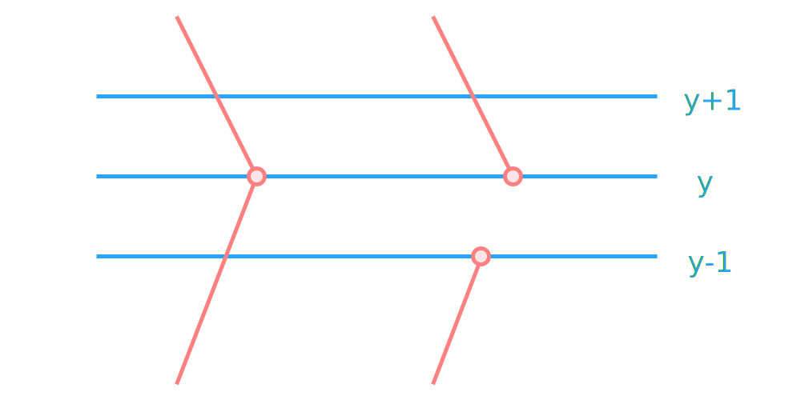{width=85%}

## {data-auto-animate="true"}

The **lower** edge is shortened to create two _new_ edge points.

{width=85%}

::: notes
I've labelled the scan lines - recall we progress in integer steps.
NB. the gradient of the edge is maintained when we split the vertex.
:::

## Scan-Line Algorithm {data-auto-animate="true"}

```
process vertices of monotonic edges

for line in y=0 to y=height:
    counter = 0
    for pixel in x=0 to x=width:
        if edge or edge-point:
            counter +=1
        if vertex:
            counter +=2
        if counter is odd:
            draw(line, pixel)
```

::: notes
As pseudocode...
we can call these split vertices edge points...
The first line in our code here describes quite a process - let's look at how we
will implement a scan-line algorithm.
:::

# Scan-Line Implementation {data-auto-animate="true"}

Expanding the pseudocode.

::: notes
There are quite a few details not shown in the pseudocode that we need to resolve.
:::

## Scan-Line Implementation {data-auto-animate="true"}

The first step is to build an array of _linked lists_, called a Bucket Sorted Edge Table (**BSET**).

::: notes
This table is indexed by y value, starting at zero.
:::

## Scan-Line Implementation {data-auto-animate="true"}

Each **node** in the _linked list_ has 3 members related to a vertex, and a pointer to the next node:

- y value of the _other_ vertex on the edge
- x value of _this_ vertex
- inverse slope of the edge
- pointer to the next node

::: notes
one edge has two vertices
we process from bottom to top - the other y value is the maximum y value of that edge.
:::

## Scan-Line Implementation {data-auto-animate="true"}

To determine edge intersections it uses the familiar slope of a line:

$$
m = \frac{y_{k+1} - y_{k}}{x_{k+1} - x_{k}} = \frac{1}{x_{k+1} - x_{k}}
\Rightarrow
x_{k+1} = x_{k} + \frac{1}{m}
$$

## Scan-Line Implementation {data-auto-animate="true"}

Before we start to build the Bucket Sorted Edge Table (**BSET**), we _split_ any vertices on **monotonic** edges.

::: incremental

- The BSET is built from the vertex with the lowest y value to the vertex with the highest y value.
- If the vertex is part of two edges, the first node is for the left edge, and the second node is for the right edge.
- Split vertices have only one edge, so only one node is entered.

:::

::: notes
this probably deserves a figure to explain in more detail.
:::

## BSET Example {data-auto-animate="true"}

::: columns
::::: column
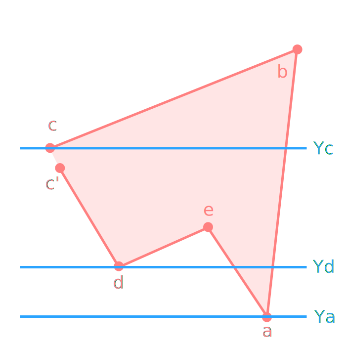
:::::
::::: column
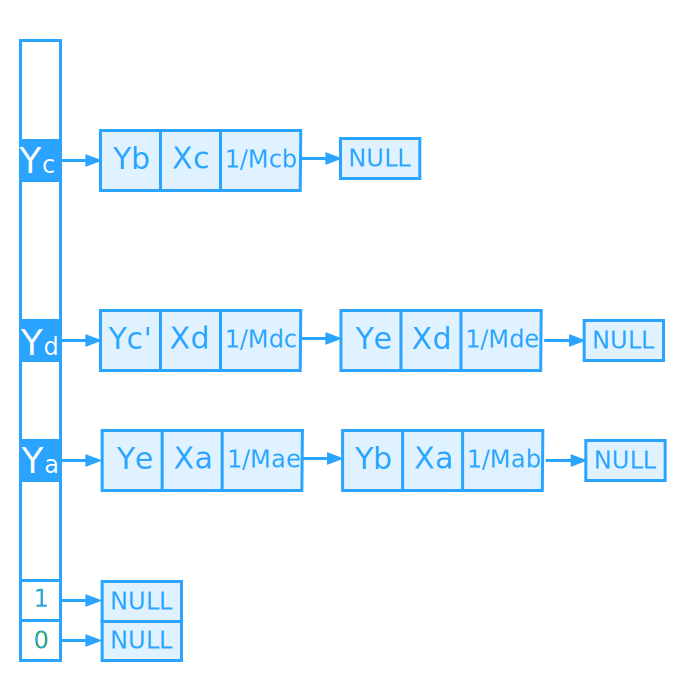
:::::
:::

::: notes
the first thing to notice is we have split vertex c, and placed a lower point c'.

the poly is somewhere in the middle of the screen - so as we scan up - y0, y1 points to null, until we reach the the value of y at vertex a - now we can make an entry in the BSET.

that first vertex has 2 edges, so we have 2 nodes in the BSET (left right edges).
node - other y value, x value, inverse slope, next node
we move up to yd - this is similar...
we do not make an entry for ye, because it is already in the table (yd).
the vertex is split - so only has one edge, so only one node.

Before we move on - questions??
:::

## Scan-Line Run Time {data-auto-animate="true"}

The BSET is an initialisation step.

- It is created once.

At runtime, we use another data structure:

- Active Linked List (**ALL**).

## Active Linked List {data-auto-animate="true"}

- Initially, the ALL points to NULL.
- Search the BSET for the first non NULL entry.
- Set the ALL to the first non NULL entry.

::: notes
so we do a linear search of the edge table, until we come to the first node that is not null.
we set the active list to that node.
:::

## Active Linked List {data-auto-animate="true"}

For our example, the ALL is first set to $y_a$.


The `draw` function will now draw from $x_a$ to $x_a$, that is, just a single point.

::: notes
we draw from one x to the next x...
here the x value is the same - so we implicitly draw the vertex twice.
please ask questions - it's really important this is well understood.
:::

## Active Linked List {data-auto-animate="true"}

Next, the scan line moves up to $Y_a + 1$.

- There is **no** entry in the BSET for this $y$ value.
- Therefore the current ALL has the $x$ values updated:

$$
x^{'}_{a} = x_{a} + \frac{1}{m_{ae}}, \quad x^{''}_{a} = x_{a} + \frac{1}{m_{ab}}
$$

::: notes
so in each node in the ALL, we add the inverse slope to the x value.
we have moved up each edge emerging from the vertex.
:::

## Active Linked List {data-auto-animate="true"}

Now, we have a new ALL:

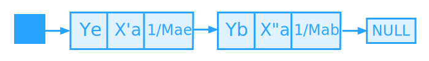

::: incremental

- The `draw` function will now draw from $x^{'}_{a}$ to $x^{''}_{a}$.
- The x values are repeated for each line
- until a new BSET entry is found.
- In our example, when we reach $y_d$.

:::

::: notes
as we progress upward in y, we set x points increasingly further apart.
:::

## Active Linked List {data-auto-animate="true"}

::: columns
::::: column

:::::
::::: column

- Scan line is now at $y_d$.
- Fetch the BSET entry for $y_d$.
- merge with the ALL in increasing order of x values.

:::::
:::
