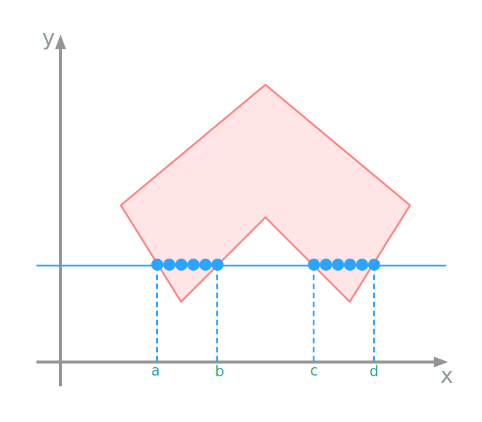

# Content

- Polygon Filling
- Scan Line Algorithm
- Boundary Fill Algorithm

::: notes
We can start with what we mean by polygon filling - then we will look at a couple of different approaches to solve the problem.
Scan-line algorithm - works line by line and left to right to fill the polygon.
Boundary fill algorithm - works by growing a seed pixel within the boundary of the polygon.
:::

# Polygon Filling {data-auto-animate="true"}

Identify pixels that belong to the _interior_ of a polygon.
Once identified, we can:

::: incremental

- pass the pixel to the rasteriser
- assign colour to the pixel
- assign a depth value to the pixel
- sample a texture for the pixel

:::

::: notes
once we identify the pixel, we can perform a number of operations, given that knowledge.
:::

## Polygon Filling {data-auto-animate="true"}

::: incremental

- A polygon is a set of vertices that are connected by _edges_.
- We need _efficient_ algorithms to fill polygons.
- We can extend ideas from line drawing to polygon filling.
- Not all polygons are handled equally!

:::

::: notes
Graphics applications often use many, many polygons.
:::

## Convex Polygons {data-auto-animate="true"}

::: columns
::::: column

:::::
::::: column

- interior angles $\leq 180^{\circ}$
- scan lines enter the interior once and exit once
- triangles are always convex

:::::
:::

::: notes
I want to be clear here - a scan line is the line we intend to draw
horizontally across the screen.
If we encounter a convex polygon it enters, then exits only once.
Triangles are convex.
One of the reasons many graphics pipelines decompose to tris - they are easier to handle.
:::

## Concave Polygons {data-auto-animate="true"}

::: columns
::::: column

:::::
::::: column

- arbitrarily complex polygons
- scan lines enter and exit many times
- more difficult to fill

:::::
:::

::: notes
can be arbitrarily complex - many vertices and edges - ngons
we need to keep track of when we enter and exit the polygon - somehow...
:::

# Scan-Line Algorithm {data-auto-animate="true"}

The scan-line algorithm must work for **both** convex and concave polygons.

## Scan-Line Algorithm {data-auto-animate="true"}

```
for line in y=0 to y=height:
    counter = 0
    for pixel in x=0 to x=width:
        if edge:
            counter +=1
        if counter is odd:
            draw(line, pixel)
```

::: notes
how about this algorithm? Does this do what we need to do?
Does it work for both convex and concave polygons?
:::

## {data-auto-animate="true"}

{width=75%}

::: notes
here we have a concave polygon, as we pass a scan line up the screen, what happens?
:::

## {data-auto-animate="true"}

{width=75%}

::: notes
It seems our algorithm works fine - as we enter from the left we add one to the counter and draw.
When we leave we increment again and stop drawing, and so on...
:::

## Scan-Line Algorithm {data-auto-animate="true"}

The algorithm seems to work well.

- Have we considered all cases?

::: notes
are there any circumstances we have not considered yet?
:::

## {data-auto-animate="true"}

{width=75%}

::: notes
here is a more complex polygon - I've labelled some vertices.
what should we do when the scan line passes through a vertex?
:::

## {data-auto-animate="true"}

{width=75%}

::: notes
what is happening here?
:::

## {data-auto-animate="true"}

::: columns
::::: {.column width=60%}

:::::
::::: {.column width=40%}

- Enter the left edge, increment the counter and draw.
- Pass through vertex $a$, increment the counter and stop drawing.
- Leave the right edge, increment the counter and draw.

:::::
:::

## {data-auto-animate="true"}

::: columns
::::: {.column width=60%}

:::::
::::: {.column width=40%}

Solution:

- count the vertex _twice_

:::::
:::
