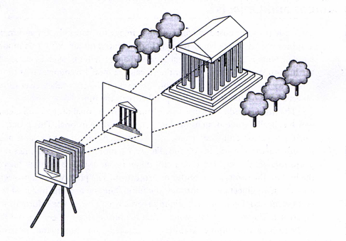
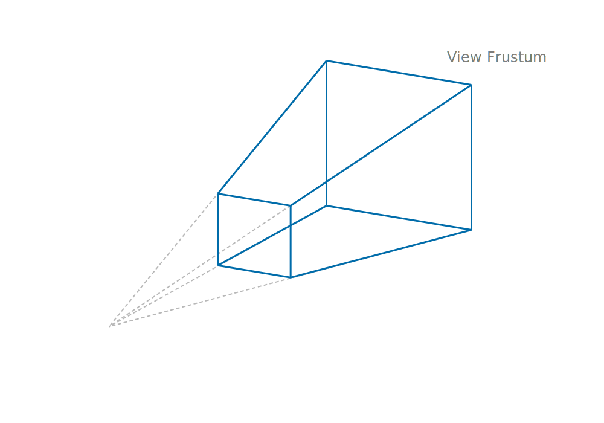
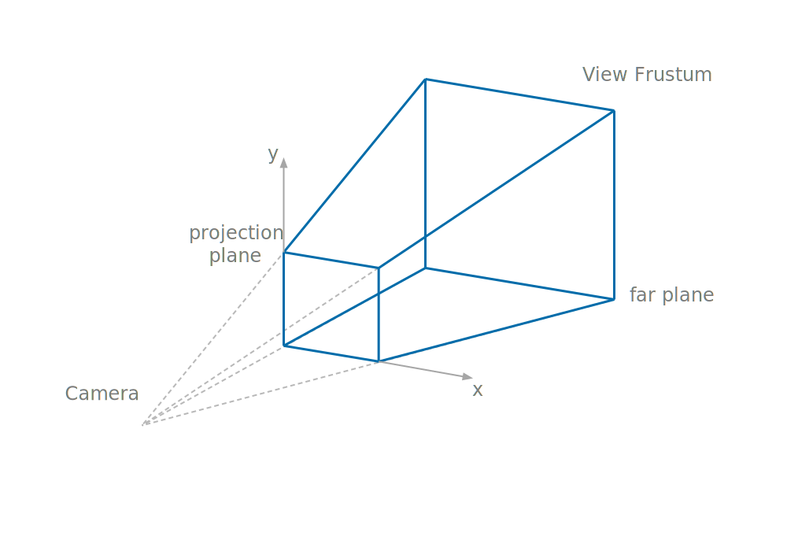
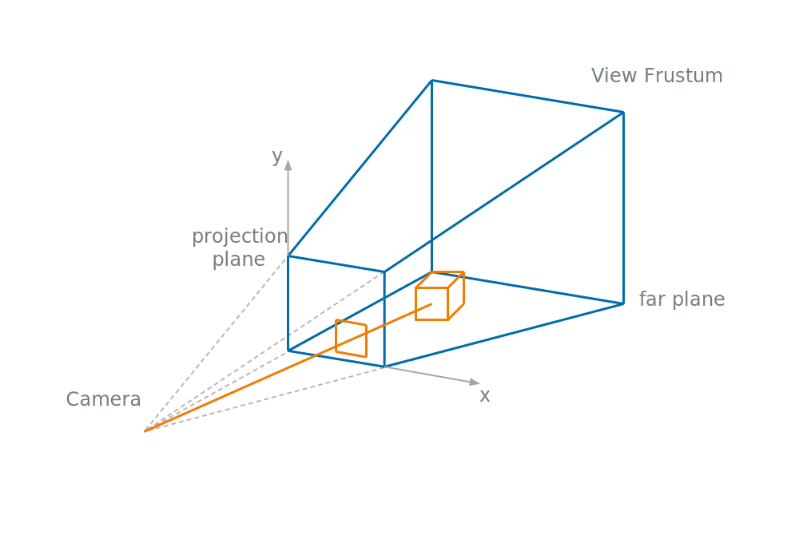
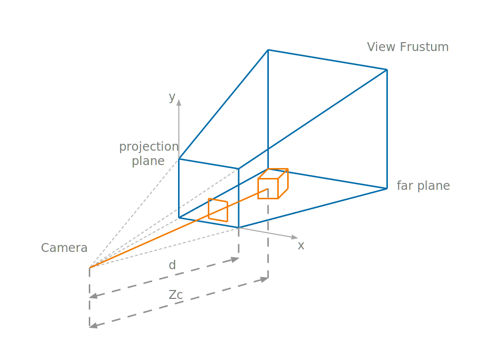
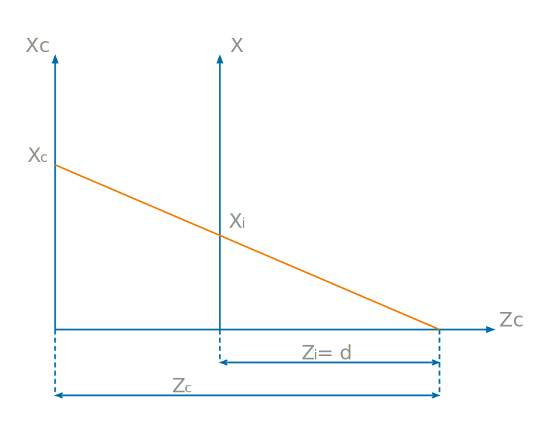
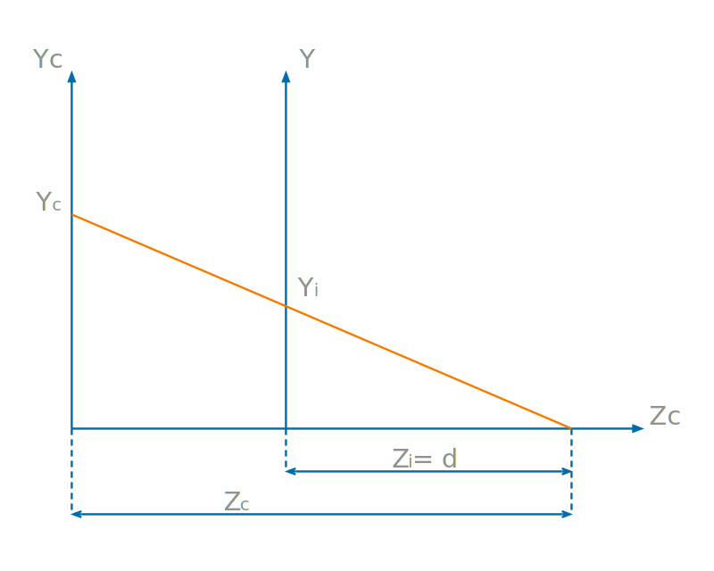

# Content

- The Camera Model
- Perspective Projection
- Orthographic Projection

# Projection

From 3D to 2D...

## Projection {data=auto-animate="true"}

To give a meaningful account of projection in graphics we have to move to 3D.

- Projection from 3D results in a 2D image.

## Projection {data=auto-animate="true"}

There are typically two types of projections we consider in graphics:

- Perspective projection
- Orthographic projection

## Camera Model {data=auto-animate="true"}

{width="70%"}

::: notes
In graphics we have a coordinate system for the world, in which all objects are placed.
We often refer to these as the **world coordinate system**.

Within the world, we have objects, that have their own coordinate system.

We have an **image** coordinate system - this is always 2D, and is where we project the objects within the world.

Then we have a camera coordinate system - this is 3D and is a view of the world with respect to the camera.

:::

## Perspective Projection {data=auto-animate="true"}

::: notes
The view frustum (a word difficult to pronounce) is a bound on the objects to be rendered.
It is defined by the angle of view, and the near and far clipping planes.
:::

## Perspective Projection {data=auto-animate="true"}

::: notes
The locus of convergence of the frustum is the position of the camera.
We project at the near clipping plane in image coordinate space.
:::

## Perspective Projection {data=auto-animate="true"}

::: notes
Only objects within the view frustum are rendered.
This is an important tool for rendering efficiently.
In project - near objects are larger, far objects are smaller.
:::

## Perspective Projection {data=auto-animate="true"}

::: notes
d = distance from camera to the projection plane (the near plane of the frustum).
Z_c = distance from camera to the object - in camera coordinate space.
:::

---

consider a horizontal cross section of the scene

---

consider a vertical cross section of the scene

