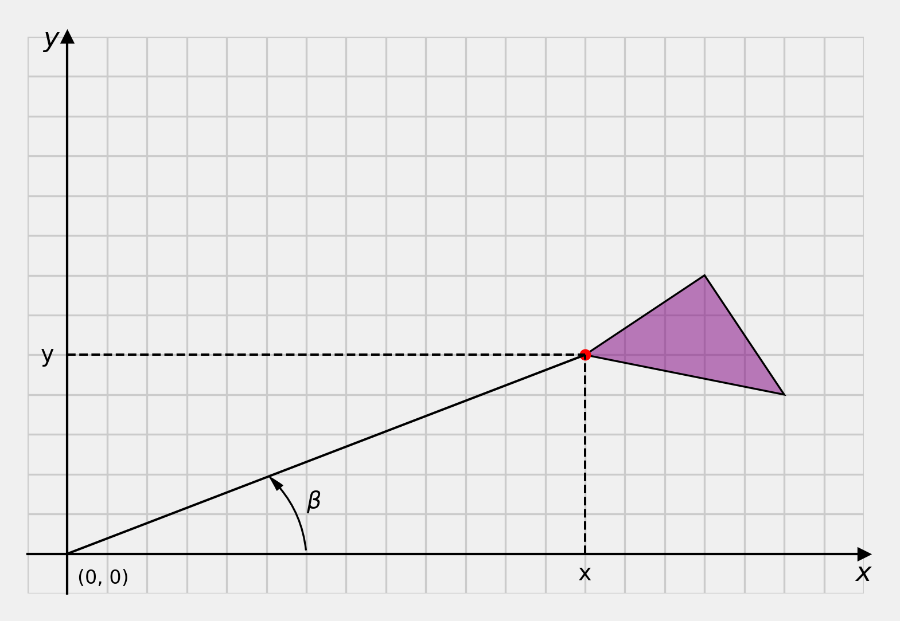
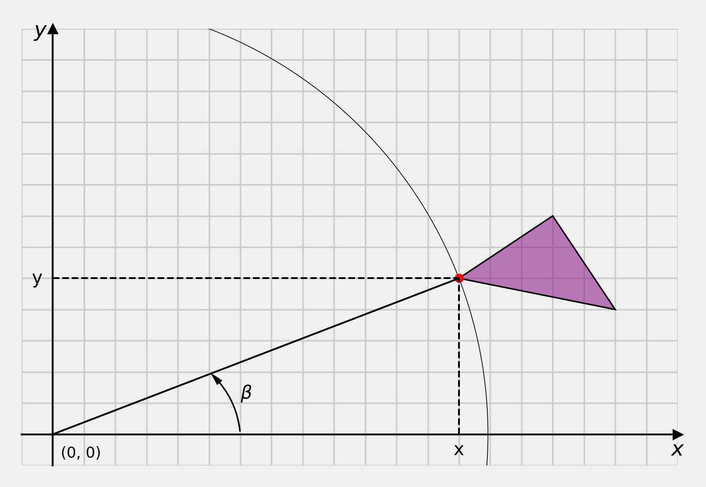
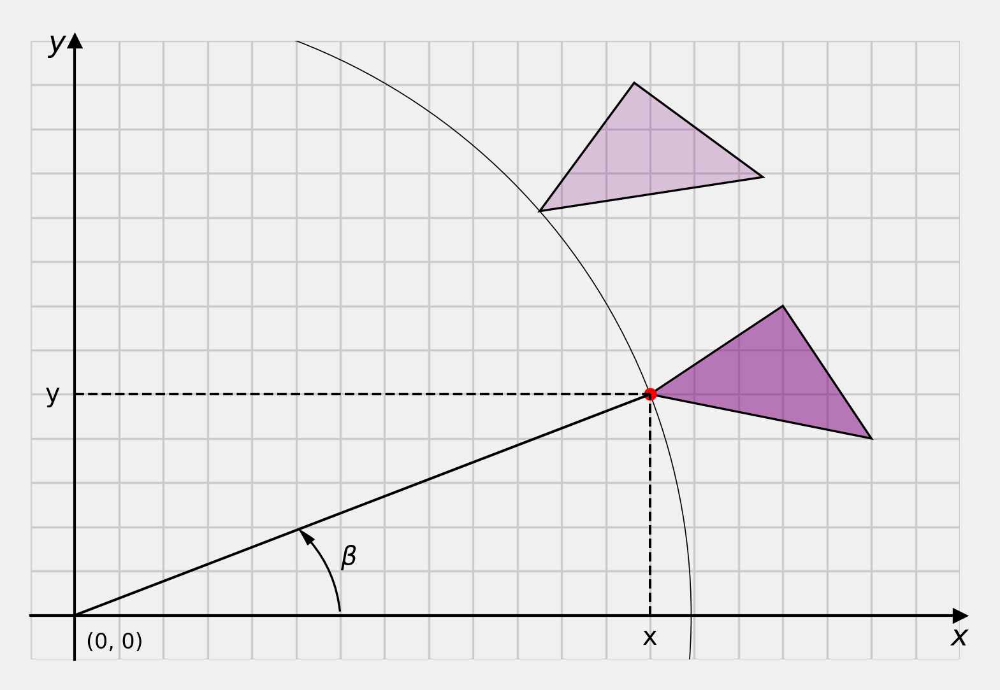
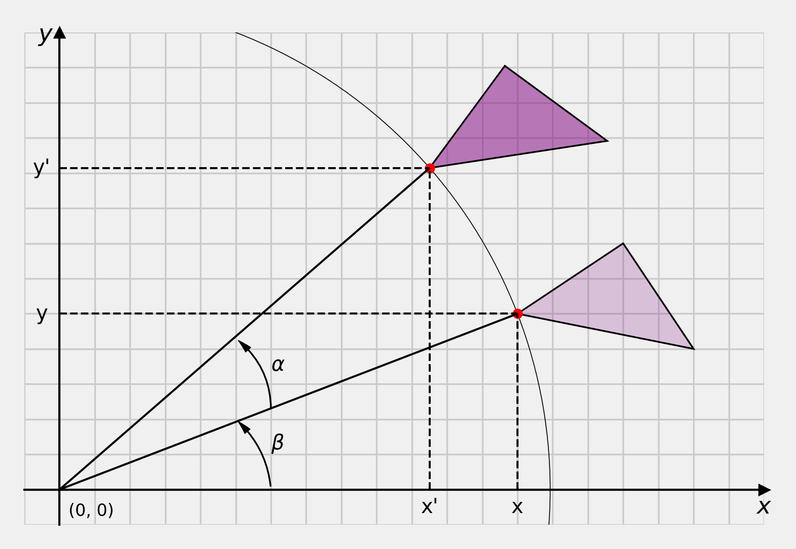
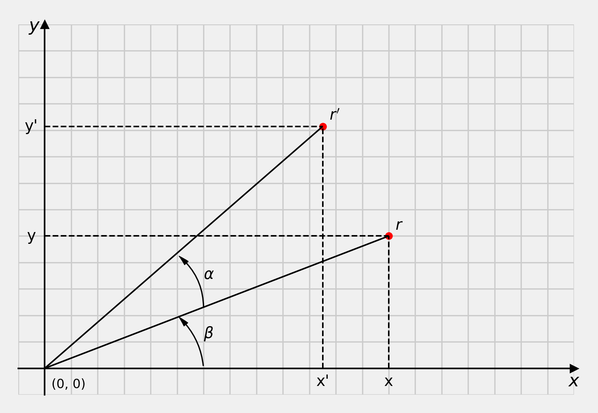

# Content

- What is a transformation?
- Types of transformations
- Translation
- Rotation

# What is a transformation

...in computer _graphics_?

## Transformations {data-auto-animate="true"}

...in 2D Computer Graphics

::: incremental

- Two spatial dimensions
- Planar world or the "plane"
- Usually represented by Cartesian **coordinates**
- $x$ and $y$ for objects
- $s$ and $t$ for textures
- $u$ and $v$ for images

:::

## Transformations {data-auto-animate="true"}

Geometric transformations will map points in one _space_ to points in another space:

$$(x',y') = f(x,y)$$

## Transformations {data-auto-animate="true"}

The mapping function uses elementary operations, which include:

- Translation
- Rotation
- Scaling
- Shear
- Reflection
- Projection
- Warp

## Transformations {data-auto-animate="true"}

Types of transformation preserve **geometric properties** of the object.

## **Rigid** transformations

::: incremental

- _Translation_ and _Rotation_
- preserves the Euclidean distance between every pair of points
- preserves "handedness" of the object

:::

::: notes
Imagine a cardboard cut out shape, that you could push about on a surface.
:::

## **Euclidean** transformations

::: incremental

- Translation, Rotation and _Reflection_
- Also known as **Isometries**
- preserves the Euclidean distance between every pair of points

:::

::: notes
Imagine a cardboard cut out shape, that you could pick up and put down any way around.
:::

## **Similarity** transformations

::: incremental

- Translation, Rotation, Reflection and _Uniform Scaling_
- preserves the shapes of the objects
- Examples of similar shapes include all squares, all circles, but not all triangles.

:::

::: notes
Some triangles are similar, and can be very useful to us, but not all triangles are similar.
:::

## **Affine** transformations

::: incremental

- Translation, Rotation, Reflection, Scaling and _Shear_
- Scaling can be uniform or non-uniform
- preserves _lines_ and _parallelism_ of objects

:::

## **Projective** transformations

::: incremental

- _Projection_ from $N$ dimensions to a lower dimension
- useful in 3D graphics but not in 2D
- _Perspective_ or _Orthographic_ projection

:::

## **Non-linear** transformations

::: incremental

- _Warp_: non-linearly deform the object.
- Example: for images we may talk about lens _distortion_.

:::

# Object Representation {data-auto-animate="true"}

- How do we represent objects in computer graphics?

## Object Representation {data-auto-animate="true"}

In graphics, we represent objects using points or _vertices_,
which are connected to form polygons or _faces_.

## Object Representation {data-auto-animate="true"}

**Only** the _vertices_ are subjected to the transformations.

## Object Representation {data-auto-animate="true"}

Question: How do we represent a vertex mathematically?

::: incremental

- A column **vector** of the vertex coordinates.

:::

## Tools for transformations {data-auto-animate="true"}

Transformations of an object are applied to **each** individual vertex of that object.

::: notes
This is important - one function is applied to all vertices for rigid transformation.
:::

## Tools for transformations {data-auto-animate="true"}

The mathematical entity used to perform a transformation to the vector of n vertex coordinates is:

A _square matrix_ of size $n$ x $n$, where $n$ is the dimension of the vertex vector.

::: notes
Although we need to move through the lecture a way before we get to this goal.
:::

# 2D Transformations

- Assume a 2D _plane_ with coordinates $x$ and $y$.
- Polygonal object is a triangle with 3 _vertices_.
- All vertices are subject to transformations we apply.

## {data-auto-animate="true"}

## {data-auto-animate="true"}

::: notes
Consider the notation used here as helpful labels. When we formally define the transformations, we will use column vectors.
:::

## Translation {data-auto-animate="true"}

Formally, we will represent vertex coordinates as a column vector:

$$\begin{bmatrix} x \\ y \end{bmatrix}$$

## Translation {data-auto-animate="true"}

Translation is performed by **adding** a _translation vector_.

$$
\begin{bmatrix} x' \\ y' \end{bmatrix} =
\begin{bmatrix} x \\ y \end{bmatrix} +
\begin{bmatrix} t_x \\ t_y \end{bmatrix}
$$

## Translation {data-auto-animate="true"}

Example: Consider the vertex with coordinates $~(-5, -2)$, that we wish to translate in the $~x~$ direction 9 units, and in the $~y~$ direction 5 units.

$$
\begin{bmatrix} 4 \\ 3 \end{bmatrix} =
\begin{bmatrix} -5 \\ -2 \end{bmatrix} +
\begin{bmatrix} 9 \\ 5 \end{bmatrix}
$$

## {data-auto-animate="true"}

::: notes
We can show this graphically by drawing a line from the origin to the translation vector.
:::

## {data-auto-animate="true"}

::: notes
But recall, we need to translate every vertex in our model by the same vector for rigid transformation.
:::

## {data-auto-animate="true"}

## {data-auto-animate="true"}

---

::: {style="font-size: 2.5em"}

$$
\begin{bmatrix} x' \\ y' \end{bmatrix} =
\begin{bmatrix} x \\ y \end{bmatrix} +
\begin{bmatrix} t_x \\ t_y \end{bmatrix}
$$

:::

::: notes
Emphasise that translation is the addition of a translation vector.
:::

# Rotation

We stated earlier, that the mathematical entity used to perform a transformations to the vector coordinates is a _matrix_.

How do we use a matrix to perform a transformation?

## Rotation {data-auto-animate="true"}

- translation moves a single point
- rotation of a point is meaningless
- we need to perform rotations about an axis

## Rotation {data-auto-animate="true"}

A mnemonic for rotation is _SOH_, _CAH_, _TOA_.

$$
sin(\theta) = \frac{O}{H},~
cos(\theta) = \frac{A}{H},~
tan(\theta) = \frac{O}{A}
$$

::: notes
recap of rotation
:::

## Rotation {data-auto-animate="true"}

We can fit this mnemonic to our 2D plane:

$$
sin(\theta) = \frac{O}{H} = \frac{y}{r},~
cos(\theta) = \frac{A}{H} = \frac{x}{r},~
tan(\theta) = \frac{O}{A} = \frac{y}{x}
$$

where $r$ is the radius of a circle.

::: notes
We usually talk about a unit circle, where r = 1.
If r does not equal one, it scales all values by it's length.
:::

---

{width=70%}

::: notes
Here, the y and the vertical dashed line is sin theta, x and the horizontal dashed line is cos theta.
Notice that the direction of angle is anticlockwise, which is positive rotation in our coordinate system.

So tan is equal to r. Be cautious when using tan in your code, consider the plot of tan...

:::

## Matrix multiplication

Matrix multiplication is performed row by column:

$$
\begin{bmatrix} ax + by \\ cx + dy \end{bmatrix} =
\begin{bmatrix} a~ ~b \\ c~ ~d \end{bmatrix} \times
\begin{bmatrix} x \\ y \end{bmatrix}
$$

- Number of columns in the first operand **must** equal the number of rows in the second operand.

## Rotation Matrix {data-auto-animate="true"}

Deriving the rotation matrix using trigonometric identities.

::: notes

let's look at the derivation - we can do this by looking at what happens when we rotate a model.

:::

---

---

---

---

---

---

---

---

$$
r = \begin{bmatrix} x \\ y \end{bmatrix} =
    \begin{bmatrix} \cos \beta \\ \sin \beta \end{bmatrix}
$$

$$
r' = \begin{bmatrix} x' \\ y' \end{bmatrix} =
     \begin{bmatrix} \cos (\alpha + \beta) \\
     \sin (\alpha + \beta) \end{bmatrix}
$$

## Ptolomy's identity {data-auto-animate="true"}

The sum of two angles:

$$\cos (\alpha + \beta) = \cos \alpha ~ \cos \beta - \sin \alpha ~ \sin \beta$$
$$\sin (\alpha + \beta) = \sin \alpha ~ \cos \beta + \cos \alpha ~ \sin \beta$$

## Rotation Matrix Derivation {data-auto-animate="true"}

using the identities:

$$
\begin{bmatrix} x' \\ y' \end{bmatrix} =
\begin{bmatrix}
\cos \alpha ~ \cos \beta - \sin \alpha ~ \sin \beta \\
\sin \alpha ~ \cos \beta + \cos \alpha ~ \sin \beta
\end{bmatrix}
$$

## Rotation Matrix Derivation {data-auto-animate="true"}

recall:

$$
\begin{bmatrix} x \\ y \end{bmatrix} =
\begin{bmatrix} \cos \beta \\ \sin \beta \end{bmatrix}
$$

substitute $x$ and $y$:

$$
\begin{bmatrix} x' \\ y' \end{bmatrix} =
\begin{bmatrix}
x \cos \alpha - y \sin \alpha \\
x \sin \alpha + y \cos \alpha
\end{bmatrix}
$$

## Rotation Matrix Derivation {data-auto-animate="true"}

as a matrix multiplication:

$$
\begin{bmatrix} x' \\ y' \end{bmatrix} =
\begin{bmatrix}
\cos \alpha &-\sin \alpha \\
\sin \alpha &~\cos \alpha
\end{bmatrix}
\begin{bmatrix} x \\ y \end{bmatrix}
$$

---

::: {style="font-size: 2.5em"}

$$
R =
\begin{bmatrix}
\cos \alpha &-\sin \alpha \\
\sin \alpha &~\cos \alpha
\end{bmatrix}
$$

:::

::: notes
finally we can derive the rotation matrix. Please remember this forever :)
:::

# Summary

- Types of transformations
- Translation
- Rotation

Reading:

- Hearn, D. et al. (2004). Computer Graphics with OpenGL.
