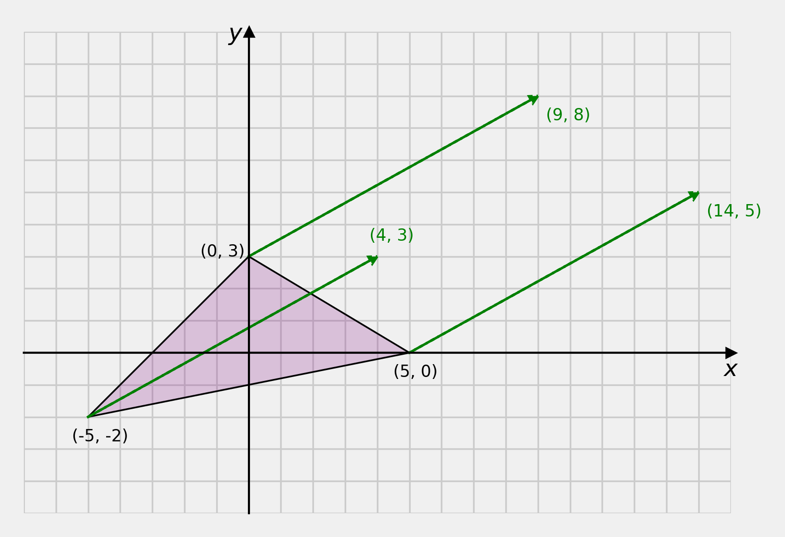

# Content

- What is a transformation?
- Types of transformations
- Translation
- Rotation

# What is a transformation

...in computer _graphics_?

## Transformations {data-auto-animate="true"}

...in 2D Computer Graphics

::: incremental

- Two spatial dimensions
- Planar world or the "plane"
- Usually represented by Cartesian **coordinates**
- $x$ and $y$ for objects
- $s$ and $t$ for textures
- $u$ and $v$ for images

:::

## Transformations {data-auto-animate="true"}

Geometric transformations will map points in one _space_ to points in another space:

$$(x',y') = f(x,y)$$

## Transformations {data-auto-animate="true"}

The mapping function uses elementary operations, which include:

- Translation, $T$
- Rotation, $R$
- Scaling, $S$
- Shear, $Sh$
- Reflection, $Re$
- Projection, $P$
- Warp, $W$

## Transformations {data-auto-animate="true"}

Types of transformation preserve **geometric properties** of the object.

## **Rigid** transformations

::: incremental

- _Translation_ and _Rotation_
- preserves the signed Euclidean distance between every pair of points

:::

::: notes
Imagine a cardboard cut out shape, that you could push about on a surface.
:::

## **Euclidean** transformations

::: incremental

- Translation, Rotation and _Reflection_
- Also known as **Isometries**
- preserves the Euclidean distance between every pair of points

:::

::: notes
Imagine a cardboard cut out shape, that you could pick up and put down any way around.
:::

## **Similarity** transformations

::: incremental

- Translation, Rotation, Reflection and _Uniform Scaling_
- preserves the shapes of the objects
- Examples of similar shapes include all squares, all circles, but not all triangles.

:::

::: notes
Some triangles are similar, and can be very useful to us, but not all triangles are similar.
:::

## **Affine** transformations

::: incremental

- Translation, Rotation, Reflection, Scaling and _Shear_
- Scaling can be uniform or non-uniform
- preserves _lines_ and _parallelism_ of objects

:::

## **Projective** transformations

::: incremental

- _Projection_ $P$ from $N$ dimensions to a lower dimension
- useful in 3D graphics but not in 2D
- _Perspective_ or _Orthographic_ projection

:::

## **Non-linear** transformations

::: incremental

- _Warp_, $W$: non-linearly deform the object.
- Example: for images we may talk about lens _distortion_

:::

# Object Representation {data-auto-animate="true"}

- How do we represent objects in computer graphics?

## Object Representation {data-auto-animate="true"}

In graphics, we represent objects using points or _vertices_,
which are connected to form polygons or _faces_.

## Object Representation {data-auto-animate="true"}

**Only** the _vertices_ are subjected to the transformations.

## Object Representation {data-auto-animate="true"}

Question: How do we represent a vertex?

::: incremental

- A **vector** of the vertex coordinates.

:::

---

---

---

---

---

---

## Rotation

