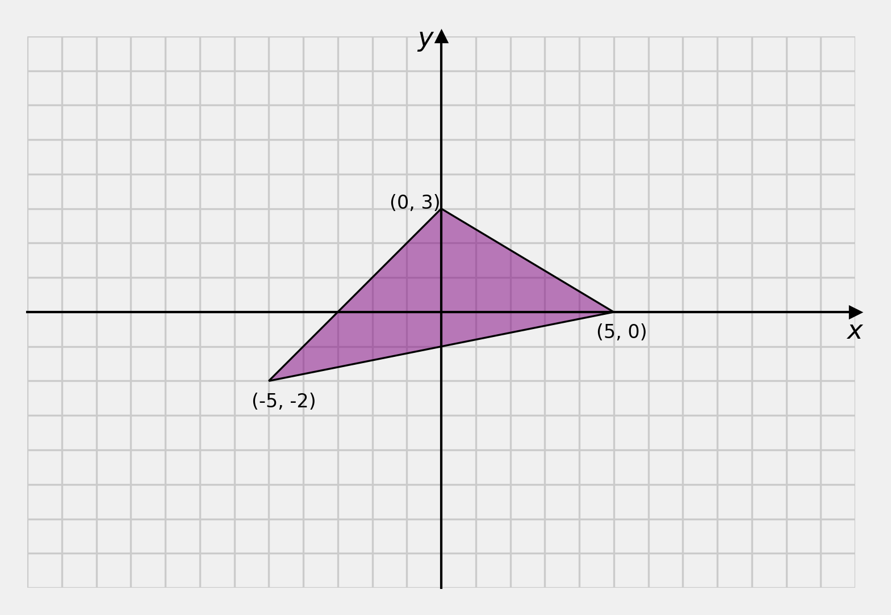
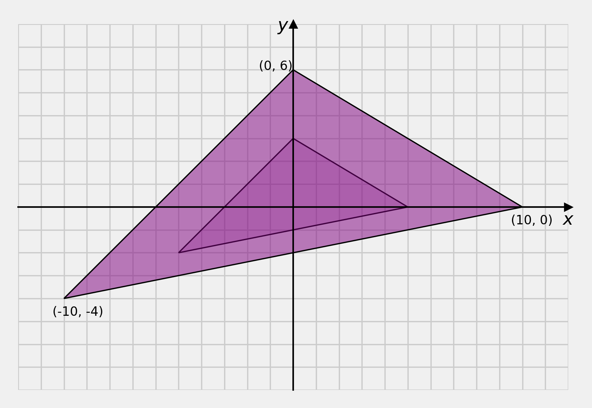
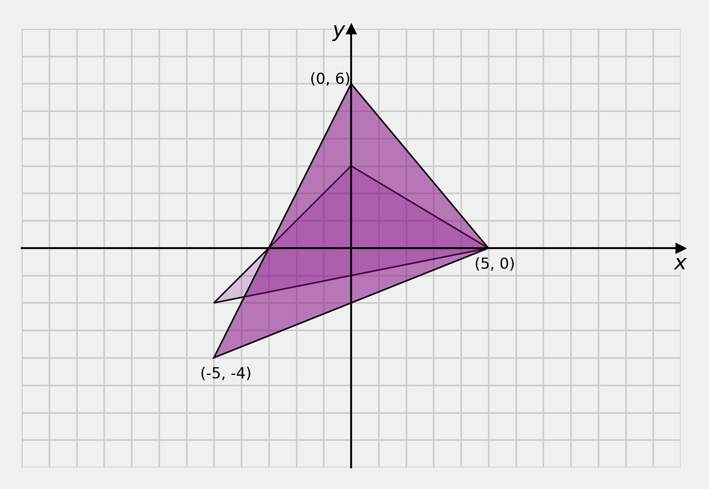
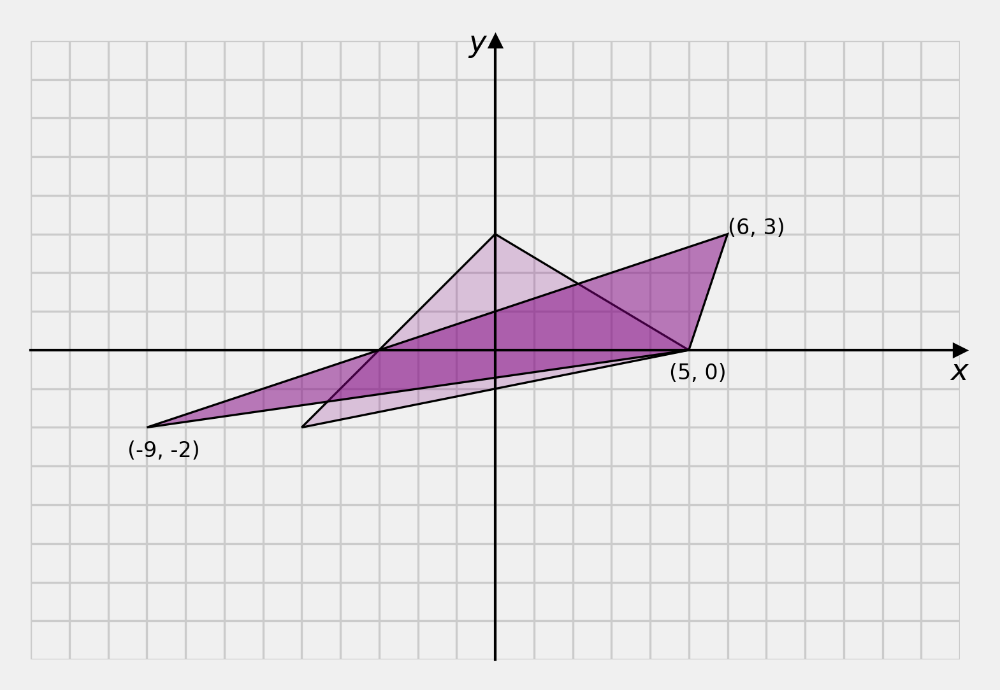

# Content

- Inverse Rotations
- Scaling and Shearing
- Homogeneous Coordinates

# Inverse Rotations

::: {style="font-size: 2.5em"}

$$R^{-1}$$

:::

## Inverse Rotations

We commonly need to compute the inverse of a rotation, for example, in the hierarchical transformations in character animation skeletons.

## Inverse Rotations

$$
\begin{aligned}
v' &= R v \\
v  &= R^{-1} v'
\end{aligned}
$$

Where $R$ is the rotation matrix and $v$ is a vertex.

## Properties of Rotation Matrices {data-auto-animate="true"}

Rotation matrices are square

::: notes
square means the dimensions are nxn.
BUT not all square matrices are rotation matrices.
We can represent rotations with alternate entities, but they are not rotation matrices.
:::

## Properties of Rotation Matrices {data-auto-animate="true"}

The determinant of a rotation matrix is 1

::: incremental

- because: $\cos^2(\theta) + \sin^2(\theta) = 1$
- hint: think about the radius in the unit circle

:::

::: notes
Pythagoras' theorem
:::

## Properties of Rotation Matrices {data-auto-animate="true"}

Rotation matrices are orthonormal

::: incremental

- column vectors are orthogonal
- column vectors are unit
- hint: think about the radius in the unit circle
- exercise: plot the column vectors

:::

::: notes
orthogonal means the vectors are perpendicular to each other.
unit means the vectors have a magnitude of 1.
:::

## Properties of Rotation Matrices {data-auto-animate="true"}

$$
R^TR = I,~ ~RR^T = I
$$

Where $I$ is the identity matrix.

::: notes
The transpose of a matrix is to write the columns of the matrix as rows.
:::

## Properties of Rotation Matrices {data-auto-animate="true"}

We can use all these properties to **test** if a matrix _is_ a rotation matrix.

::: notes
This can be really useful in debugging your code.
:::

## Inverse Rotation Matrices {data-auto-animate="true"}

Therefore the _inverse_ of a rotation matrix **is** the _transpose_ of the rotation matrix.

$$
R^{-1} = R^T
$$

::: notes
We do not need to calculate the inverse using the adjunct and cofactors, or by elimination, etc.
:::

## Inverse Rotation Matrices {data-auto-animate="true"}

Therefore the _inverse_ of a rotation matrix **is** the _transpose_ of the rotation matrix.

$$
\begin{bmatrix}
\cos \alpha &-\sin \alpha \\
\sin \alpha &~\cos \alpha
\end{bmatrix}^{-1} =
\begin{bmatrix}
\cos \alpha &-\sin \alpha \\
\sin \alpha &~\cos \alpha
\end{bmatrix}^T =
\begin{bmatrix}
~\cos \alpha &\sin \alpha \\
-\sin \alpha &\cos \alpha
\end{bmatrix}
$$

::: notes
You can see this is also equivalent to rotating in the opposite direction.
This is trivial in 2D, but in 3D, it is not.
:::

# Scaling, Shearing and Reflection

for _Affine_ transformations

## Scaling {data-auto-animate="true"}

We can separate scaling to uniform scaling and non-uniform scaling.

## Uniform Scaling {data-auto-animate="true"}

$$
\begin{bmatrix} x' \\ y' \end{bmatrix} =
\begin{bmatrix}s~ ~0 \\ 0~ ~s \end{bmatrix}
\begin{bmatrix} x \\ y \end{bmatrix}
$$

::: notes
reminder : we apply this operation to all vertices
:::

---

---

## Uniform Scaling {data-auto-animate="true"}

In the example, notice that all vertices are scaled equally by 2.

::: notes
each x value is multiplied by 2. each y value is multiplied by 2.
:::

## Non-Uniform Scaling {data-auto-animate="true"}

$$
\begin{bmatrix} x' \\ y' \end{bmatrix} =
\begin{bmatrix}s_x~ ~0 \\ 0~ ~s_y \end{bmatrix}
\begin{bmatrix} x \\ y \end{bmatrix}
$$

---

---

## Non-Uniform Scaling {data-auto-animate="true"}

In the non-uniform example, notice that all vertices are scaled in the $y$ direction by 2 and in the $x$ direction by 1, so there is no change in $x$.

## Non-Uniform Scaling {data-auto-animate="true"}

Notice that _uniform_ scaling is nothing more than a special case of non-uniform scaling where $s_x = s_y$.
Hence, from now on, we will consider scaling in its generalised form where both uniform and non-uniform are possible.

## Shearing {data-auto-animate="true"}

Shearing is an operation that moves vertices parallel to an axis, scaled by the distance from that axis.

## Shearing {data-auto-animate="true"}

To shear parallel to the $x$ axis:

$$
\begin{bmatrix} x' \\ y' \end{bmatrix} =
\begin{bmatrix} 1~ ~\lambda \\ 0~ ~1 \end{bmatrix}
\begin{bmatrix} x \\ y \end{bmatrix}
$$

---

---

---

To shear parallel to the $y$ axis:

$$
\begin{bmatrix} x' \\ y' \end{bmatrix} =
\begin{bmatrix} 1~ ~0 \\ \lambda~ ~1 \end{bmatrix}
\begin{bmatrix} x \\ y \end{bmatrix}
$$

---

