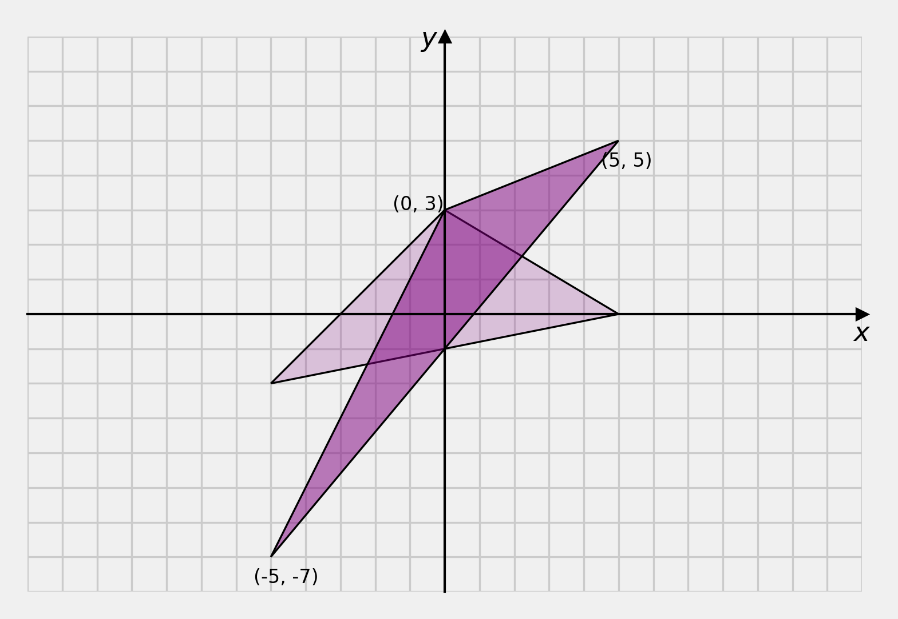
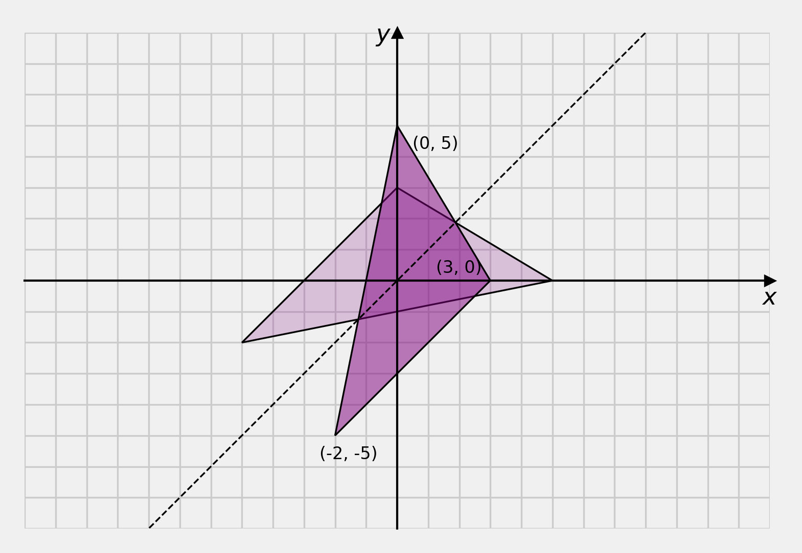

# Content

- Inverse Rotations
- Scaling, Shearing, and Reflection
- Homogeneous Coordinates

# Inverse Rotations

::: {style="font-size: 2.5em"}

$$R^{-1}$$

:::

## Inverse Rotations

We commonly need to compute the inverse of a rotation, for example, in the hierarchical transformations in character animation skeletons.

## Inverse Rotations

$$
\begin{aligned}
v' &= R v \\
v  &= R^{-1} v'
\end{aligned}
$$

Where $R$ is the rotation matrix and $v$ is a vertex.

## Properties of Rotation Matrices {data-auto-animate="true"}

Rotation matrices are square

::: notes
square means the dimensions are nxn.
BUT not all square matrices are rotation matrices.
We can represent rotations with alternate entities, but they are not rotation matrices.
:::

## Properties of Rotation Matrices {data-auto-animate="true"}

The determinant of a rotation matrix is 1

::: incremental

- because: $\cos^2 \alpha + \sin^2 \alpha = 1$
- hint: think about the radius in the unit circle

:::

::: notes
Pythagoras' theorem
Determinant: a*d - b*c
:::

## Properties of Rotation Matrices {data-auto-animate="true"}

Rotation matrices are orthonormal

::: incremental

- column vectors are orthogonal
- column vectors are unit
- hint: think about the radius in the unit circle
- exercise: plot the column vectors

:::

::: notes
orthogonal means the vectors are perpendicular to each other.
unit means the vectors have a magnitude of 1.
:::

## Properties of Rotation Matrices {data-auto-animate="true"}

$$
R^TR = I,~ ~RR^T = I
$$

Where $I$ is the identity matrix.

::: notes
The transpose of a matrix is to write the columns of the matrix as rows.
:::

## Properties of Rotation Matrices {data-auto-animate="true"}

We can use all these properties to **test** if a matrix _is_ a rotation matrix.

::: notes
This can be really useful in debugging your code.
:::

## Inverse Rotation Matrices {data-auto-animate="true"}

Therefore the _inverse_ of a rotation matrix **is** the _transpose_ of the rotation matrix.

$$
R^{-1} = R^T
$$

::: notes
We do not need to calculate the inverse using the adjunct and cofactors, or by elimination, etc.
:::

## Inverse Rotation Matrices {data-auto-animate="true"}

Therefore the _inverse_ of a rotation matrix **is** the _transpose_ of the rotation matrix.

$$
\begin{bmatrix}
\cos \alpha &-\sin \alpha \\
\sin \alpha &~\cos \alpha
\end{bmatrix}^{-1} =
\begin{bmatrix}
\cos \alpha &-\sin \alpha \\
\sin \alpha &~\cos \alpha
\end{bmatrix}^T =
\begin{bmatrix}
~\cos \alpha &\sin \alpha \\
-\sin \alpha &\cos \alpha
\end{bmatrix}
$$

::: notes
You can see this is also equivalent to rotating in the opposite direction.
This is trivial in 2D, but in 3D, it is not.
:::

# Scaling, Shearing and Reflection

for _Affine_ transformations

## Scaling {data-auto-animate="true"}

We can separate scaling to uniform scaling and non-uniform scaling.

## Uniform Scaling {data-auto-animate="true"}

$$
\begin{bmatrix} x' \\ y' \end{bmatrix} =
\begin{bmatrix}s~ ~0 \\ 0~ ~s \end{bmatrix}
\begin{bmatrix} x \\ y \end{bmatrix}
$$

::: notes
reminder : we apply this operation to all vertices
:::

---

---

## Uniform Scaling {data-auto-animate="true"}

In the example, notice that all vertices are scaled equally by 2.

::: notes
each x value is multiplied by 2. each y value is multiplied by 2.
:::

## Non-Uniform Scaling {data-auto-animate="true"}

$$
\begin{bmatrix} x' \\ y' \end{bmatrix} =
\begin{bmatrix}s_x~ ~0 \\ 0~ ~s_y \end{bmatrix}
\begin{bmatrix} x \\ y \end{bmatrix}
$$

---

---

## Non-Uniform Scaling {data-auto-animate="true"}

In the non-uniform example, notice that all vertices are scaled in the $y$ direction by 2 and in the $x$ direction by 1, so there is no change in $x$.

## Non-Uniform Scaling {data-auto-animate="true"}

Notice that _uniform_ scaling is nothing more than a special case of non-uniform scaling where $s_x = s_y$.
Hence, from now on, we will consider scaling in its generalised form where both uniform and non-uniform are possible.

## Shearing {data-auto-animate="true"}

Shearing is an operation that moves vertices parallel to an axis, scaled by the distance from that axis.

## Shearing {data-auto-animate="true"}

To shear parallel to the $x$ axis:

$$
\begin{bmatrix} x' \\ y' \end{bmatrix} =
\begin{bmatrix} 1~ ~\lambda \\ 0~ ~1 \end{bmatrix}
\begin{bmatrix} x \\ y \end{bmatrix}
$$

---

---

---

To shear parallel to the $y$ axis:

$$
\begin{bmatrix} x' \\ y' \end{bmatrix} =
\begin{bmatrix} 1~ ~0 \\ \lambda~ ~1 \end{bmatrix}
\begin{bmatrix} x \\ y \end{bmatrix}
$$

---

## Reflection {data-auto-animate="true"}

Reflection is an operation that imposes _symmetry_ across an axis.

## Reflection {data-auto-animate="true"}

To reflect across the $y$ axis:

$$
\begin{bmatrix} x' \\ y' \end{bmatrix} =
\begin{bmatrix} -1& 0 \\ ~ ~0& 1 \end{bmatrix}
\begin{bmatrix} x \\ y \end{bmatrix}
$$

---

---

::: notes
we could say the model is flipped left to right.
:::

## Reflection {data-auto-animate="true"}

To reflect across the $x$ axis:

$$
\begin{bmatrix} x' \\ y' \end{bmatrix} =
\begin{bmatrix} 1& \hfill 0 \\ 0& \hfill -1 \end{bmatrix}
\begin{bmatrix} x \\ y \end{bmatrix}
$$

---

::: notes
we could say the model is flipped top to bottom.
:::

## Reflection {data-auto-animate="true"}

To reflect across the $x=y$ axis:

$$
\begin{bmatrix} x' \\ y' \end{bmatrix} =
\begin{bmatrix} 0& ~1 \\ 1& ~0 \end{bmatrix}
\begin{bmatrix} x \\ y \end{bmatrix}
$$

---

# Homogeneous Coordinates

_adjective:_ "of the same kind; alike."

## 2D transformations: A slight problem

::: incremental

- We have so far, explored a number of elementary transformations in 2D.
- For ease of implementation, it would be better if _translation_ could also be done using matrix multiplication.
- Solution: **Homogeneous** Coordinates.

:::

::: notes
(as we do for rotation and scaling) rather than vector addition!
:::

## Homogeneous Coordinates {data-auto-animate="true"}

::: incremental

- Define a new set of coordinates one dimension higher.
- For 2D, $\mathbb{R}^{2} \rightarrow \mathbb{R}^{3}$
- We add a third coordinate $w$.

:::

::: notes
For 3D, we add a 4th coordinate...
:::

## Homogeneous Coordinates {data-auto-animate="true"}

The homogeneous coordinates relate to our 2D coordinates as follows:

$$
x_h = \frac{x}{w}~, ~y_h = \frac{y}{w}~, ~w
$$

## Homogeneous Coordinates {data-auto-animate="true"}

Thus: $x = w x_h$, $y = w y_h$.

::: incremental

- $w$ functions as a _scaling factor_.
- we can set $w$ to 1, so $x = x_h$, $y = y_h$
- How do we use 3D homogeneous coordinates to represent 2D transformations?

:::

## Homogeneous Coordinates {data-auto-animate="true"}

For a general transformation operation, we extend the matrix multiplication we have seen so far, to include the $w$ coordinate:

$$
\begin{bmatrix} x' \\ y' \\ 1 \end{bmatrix} =
\begin{bmatrix} a~ ~b~ ~c~ \\ d~ ~e~ ~f~ \\ 0~ ~0~ ~1 \end{bmatrix}
\begin{bmatrix} x \\ y \\ 1 \end{bmatrix}
$$

## Homogeneous Rotation {data-auto-animate="true"}

For our homogeneous 3 x 3 transformation matrix, **rotation** is now:

$$
\begin{bmatrix} x' \\ y' \\ 1 \end{bmatrix} =
\begin{bmatrix}
\cos \alpha&        -\sin \alpha& ~0 \\
\sin \alpha&  \hfill \cos \alpha& ~0 \\
          0&                   0& ~1
\end{bmatrix}
\begin{bmatrix} x \\ y \\ 1 \end{bmatrix}
$$

## Homogeneous Rotation {data-auto-animate="true"}

Remains a _true_ rotation matrix; **all** the properties of a rotation matrix are preserved.

$$
\begin{bmatrix} x' \\ y' \\ 1 \end{bmatrix} =
\begin{bmatrix}
\cos \alpha&        -\sin \alpha& ~0 \\
\sin \alpha&  \hfill \cos \alpha& ~0 \\
          0&                   0& ~1
\end{bmatrix}
\begin{bmatrix} x \\ y \\ 1 \end{bmatrix}
$$

::: notes
The inverse is the transpose, it is orthonormal.
:::

## Homogeneous Scaling {data-auto-animate="true"}

For our homogeneous 3 x 3 transformation matrix, **scaling** is now:

$$
\begin{bmatrix} x' \\ y' \\ 1 \end{bmatrix} =
\begin{bmatrix}
s_x& ~0&   ~0 \\
0  & ~s_y& ~0 \\
0  & ~0  & ~1
\end{bmatrix}
\begin{bmatrix} x \\ y \\ 1 \end{bmatrix}
$$

## Homogeneous Coordinates {data-auto-animate="true"}

For our homogeneous 3 x 3 transformation matrix, generally,
the 2 x 2 matrix of the 2D elementary operations occupies the top left corner:

$$
\begin{bmatrix} x' \\ y' \\ 1 \end{bmatrix} =
\begin{bmatrix}
a  & ~b& ~0 \\
c  & ~d& ~0 \\
0  & ~0  & ~1
\end{bmatrix}
\begin{bmatrix} x \\ y \\ 1 \end{bmatrix}
$$

::: notes
this idea holds for higher dimensions too
:::

## Homogeneous Translation {data-auto-animate="true"}

How do we fit a translation into our 3 x 3 matrix?

$$
\begin{bmatrix} x' \\ y' \\ 1 \end{bmatrix} =
\begin{bmatrix}
1  & ~0& ~t_x \\
0  & ~1& ~t_y \\
0  & ~0& ~1
\end{bmatrix}
\begin{bmatrix} x \\ y \\ 1 \end{bmatrix}
$$

::: notes
Finally, we arrive at the reason for introducing homogeneous coordinates.
:::

# Summary

- Inverse Rotations
- Scaling, Shearing, and Reflection
- Homogeneous Coordinates

Reading:

- Hearn, D. et al. (2004). Computer Graphics with OpenGL.

::: notes
We have covered quite a lot...
We looked at the properties of rotation matrices, allowing us to compute the inverse easily.

We covered other elementary operations, such as scaling, shearing, and reflection.

We have introduced matrix operations for translation, giving us a unified, or homogeneous, model for 2D transformations.
:::
